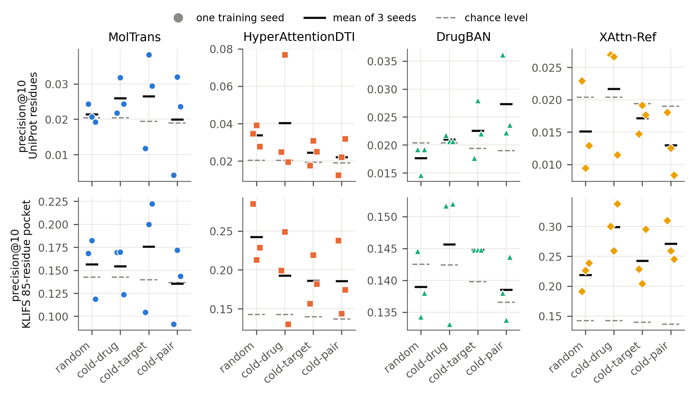
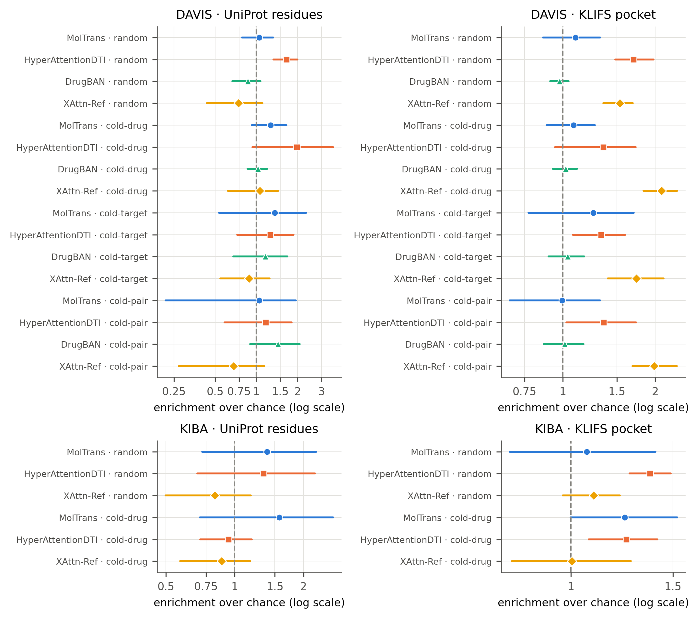
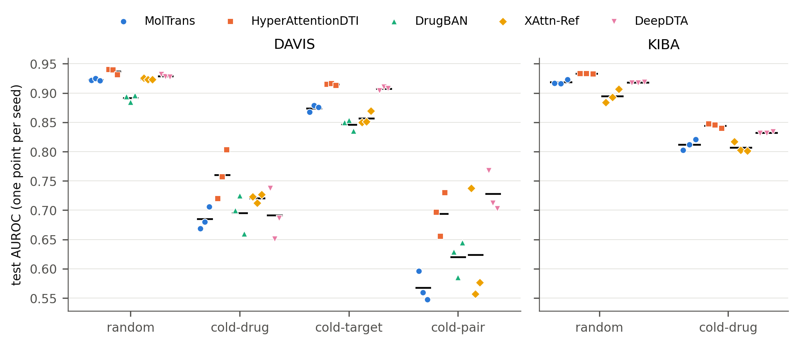
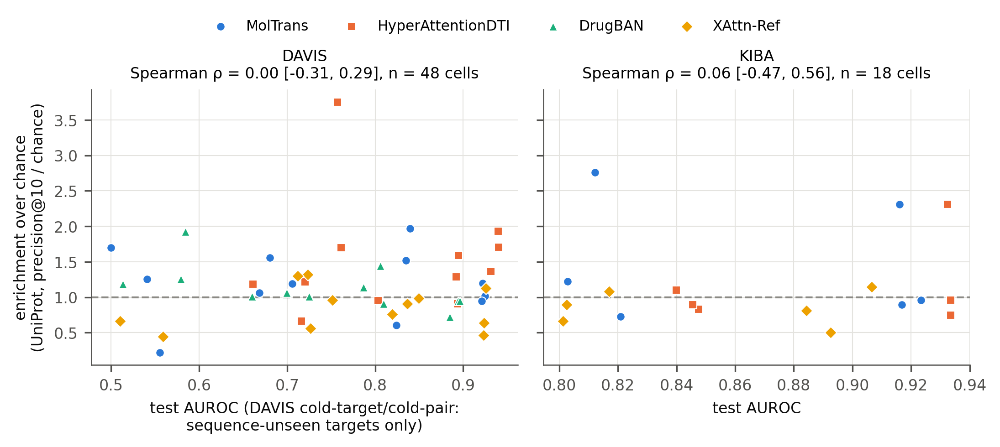
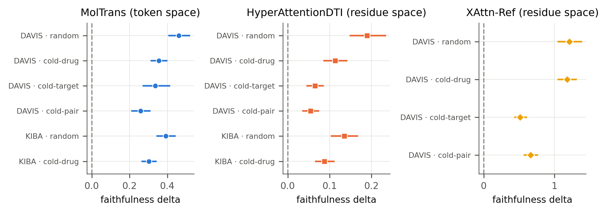
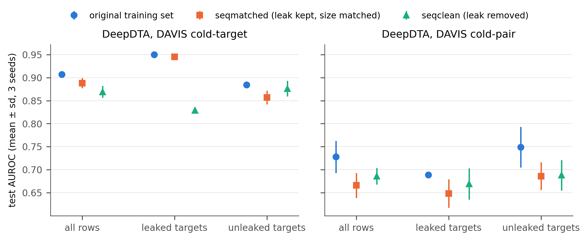

# Seed-dependent verdicts: a calibrated audit of attention-based binding-site explanations in drug–target interaction models

<!-- Generated by scripts/build_instructor_draft.py from the section files in paper/v2/; edit those and re-run. Every digit keeps its hidden source tag. -->

## Abstract

Attention maps over the protein are routinely presented as evidence of where a drug binds, usually
from a single training run on a random split. We ask whether such binding-site verdicts are stable
enough to report. Four attention-based drug–target interaction models (MolTrans, HyperAttentionDTI,
DrugBAN and XAttn-Ref, an in-house reference model) and a no-attention accuracy anchor were each
retrained with three seeds on identical kinase splits at up to four levels of distribution shift,
giving 84 trained cells on DAVIS and KIBA. <!-- src: docs/REMEDIATION_LEDGER.md:140 = 84 -->
Explanations were scored with a calibrated battery: chance and ceiling for every cell, a uniform-map
floor, a positive control, positional and residue-identity nulls, a size-matched random-masking
control for faithfulness, and Holm correction over declared families.

The dominant finding is instability: in 11 of 22 model–dataset–level cells the three seeds disagree
about their own verdict, meaning that they fall on different sides of the uncorrected α = 0.05 threshold
of an exact per-seed permutation test. <!-- src: src/evaluation/seed_agreement.py:21 = 0.05 -->
<!-- src: results/certification/key_numbers.csv#name=seeds_disagree_exact->value = 11 --> <!-- src: results/certification/key_numbers.csv#name=cells_total->value = 22 -->
In 21 of 22 cells the range of the three seeds' precision@10 exceeds the cell's distance from chance,
<!-- src: results/certification/key_numbers.csv#name=spread_exceeds_distance->value = 21 --> <!-- src: results/certification/key_numbers.csv#name=cells_total->value = 22 -->
and testing seed variance directly (Friedman and permutation tests) finds significant differences between
seeds in 7 to 8 of 22 cells after Holm correction.
<!-- src: results/certification/key_numbers.csv#name=friedman_holm->value = 8 --> <!-- src: results/certification/key_numbers.csv#name=cells_total->value = 22 -->
<!-- src: results/certification/key_numbers.csv#name=permutation_holm->value = 7 --> <!-- src: results/certification/key_numbers.csv#name=cells_total->value = 22 -->
After correction (Holm on the median p over seeds), 1 of 20 DAVIS cells supports residue-level binding-site recovery (HyperAttentionDTI,
random split, 1.66× chance) and 0 of 8 KIBA cells do; a bootstrap that resamples seeds as well as
targets agrees, leaving only that cell's interval above chance.
<!-- src: results/analysis_davis_policyA/audit_davis_binary_10k_permutations.md:15 = 1, 20 -->
<!-- src: results/analysis_kiba_policyA/audit_kiba_binary_10k_permutations.md:14 = 0, 8 -->
<!-- src: results/effects_v2_2d/enrichment.csv#family=P1&model=hyperattentiondti&level=random->enrichment = 1.66 -->
<!-- claim "only that cell's interval above chance": results/effects_v2_2d/enrichment.csv, families P1 and P2 (22 rows), enrichment_low > 1 only for P1 hyperattentiondti random -->
What does replicate is coarser. The attention of HyperAttentionDTI, MolTrans and XAttn-Ref is
load-bearing at every level; DrugBAN's is not, its masking effect sitting near zero and changing sign
between seeds (−0.0073 at cold-drug and −0.0037 at cold-pair for the first seed). XAttn-Ref's map is
enriched in the ATP pocket at every DAVIS level and HyperAttentionDTI's at three of four (cold-pair only marginally), at 1.33–2.10×
chance with conservation not controlled.
<!-- src: results/analysis_davis_policyA/faithfulness_drugban_davis_seed1.md:6 = -0.0073 -->
<!-- src: results/analysis_davis_policyA/faithfulness_drugban_davis_seed1.md:8 = -0.0037 -->
<!-- src: results/effects_v2_2d/enrichment.csv#family=S3-D&model=hyperattentiondti&level=cold_target->enrichment = 1.33 -->
<!-- src: results/effects_v2_2d/enrichment.csv#family=S3-D&model=coldsite_dti&level=cold_drug->enrichment = 2.10 -->
<!-- claim "load-bearing at every level": results/effects_v2_2d/faithfulness_effects.csv, load_bearing_ci True in all 16 rows (XAttn-Ref, HyperAttentionDTI, MolTrans; seeds and targets resampled) -->
<!-- claim "DrugBAN's is not ... changing sign": results/analysis_davis_policyA/faithfulness_drugban_davis_seed{1,2,3}.md, 6 of 12 seed-level deltas negative (seed 1 cold-drug, cold-pair; seed 2 warm, cold-drug, cold-pair; seed 3 cold-target); no interval (per-pair values not recorded) -->
<!-- claim "XAttn-Ref every DAVIS level, HyperAttentionDTI three of four": S3-D rows of results/effects_v2_2d/enrichment.csv, enrichment_low > 1 at all four levels for coldsite_dti and at random, cold_target, cold_pair for hyperattentiondti (cold_drug 0.94) -->
Which residues a map highlights also depends on an unreported readout choice. DAVIS's
wild-type-sequence duplication inflates the AUROC of a DeepDTA baseline on the leaked cold-target rows by
0.116 (p = 0.0013, three seeds); on the strictly unleaked rows no inflation is detectable (−0.019, p = 0.31).
<!-- src: results/certification/key_numbers.csv#name=leak_ct_leaked_rows->value,p = 0.116, 0.0013 -->
<!-- src: results/certification/key_numbers.csv#name=leak_ct_unleaked_rows->value,p = -0.019, 0.31 -->
A single-seed attention figure cannot carry a binding-site claim for these models.

## Key Points

* Binding-site verdicts from attention are not self-consistent across training seeds: the three seeds
  of a cell disagree about their own verdict (fall on different sides of the uncorrected α = 0.05 threshold)
  in 11 of 22 cells; the seeds' range exceeds the distance from chance in 21 of 22; and a direct test of
  seed variance is significant in 7 to 8 of 22 cells after Holm correction.
  <!-- src: src/evaluation/seed_agreement.py:21 = 0.05 -->
  <!-- src: results/certification/key_numbers.csv#name=seeds_disagree_exact->value = 11 --> <!-- src: results/certification/key_numbers.csv#name=cells_total->value = 22 -->
  <!-- src: results/certification/key_numbers.csv#name=spread_exceeds_distance->value = 21 --> <!-- src: results/certification/key_numbers.csv#name=cells_total->value = 22 -->
  <!-- src: results/certification/key_numbers.csv#name=friedman_holm->value = 8 --> <!-- src: results/certification/key_numbers.csv#name=cells_total->value = 22 -->
  <!-- src: results/certification/key_numbers.csv#name=permutation_holm->value = 7 --> <!-- src: results/certification/key_numbers.csv#name=cells_total->value = 22 -->
* A calibrated battery — chance, ceiling, uniform floor, a positive control that detects a dose of
  0.02 of the true sites at every DAVIS level, nulls and Holm correction — is needed before a verdict
  can be read. <!-- src: results/positive_control_davis.md:11 = 0.02 -->
* Under that battery, residue-level recovery survives in 1 of 20 DAVIS cells and 0 of 8 KIBA cells;
  what replicates is coarser: load-bearing attention in three of four models (not DrugBAN) and
  pocket-level enrichment.
  <!-- src: results/analysis_davis_policyA/audit_davis_binary_10k_permutations.md:15 = 1, 20 -->
  <!-- src: results/analysis_kiba_policyA/audit_kiba_binary_10k_permutations.md:14 = 0, 8 -->
* The verdict depends on the readout: two defensible reductions of the same HyperAttentionDTI weights
  place 0.367 and 0.081 of their top-ten residues in the ATP pocket at the cold-target level, against a
  chance of 0.140.
  <!-- src: results/readout_comparison.csv#ground truth=klifs&model=hyperattentiondti&readout=maxchannel&level=cold_target->precision@10 = 0.367 -->
  <!-- src: results/readout_comparison.csv#ground truth=klifs&model=hyperattentiondti&readout=receptive&level=cold_target->precision@10,chance = 0.081, 0.140 -->
* Benchmark leakage is quantified rather than only reported: 54 DAVIS mutants carry exactly the
  wild-type sequence, and in a DeepDTA retrain at the cold-target split the sequence match inflates AUROC
  on the leaked rows by 0.116 (p = 0.0013), with no detectable inflation on the unleaked rows.
  <!-- src: results/sequence_audit_davis.md:9 = 54 -->
  <!-- src: results/certification/key_numbers.csv#name=leak_ct_leaked_rows->value,p = 0.116, 0.0013 -->

## 1 Introduction

Sequence-based drug–target interaction (DTI) models increasingly present an explanation beside the
prediction: an attention map over the protein that is read as marking where the drug binds.
MolTrans (2021) [MOLTRANS_FIG_X], HyperAttentionDTI (2022) [HYPERATTENTION_FIG_X] and DrugBAN (2023)
[DRUGBAN_FIG_X] each display such maps, and later models report interpretability beside cold-start
accuracy (for example GPS-DTI, 2025; CS-DTA, 2026). A medicinal chemist choosing residues to mutate,
or a chemical series to pursue against a new target, may reasonably read such a figure as mechanistic
evidence. Whether it can bear that reading is an empirical question about the figure, not about the
model's accuracy.

That question has been asked of attention in natural-language processing, where attention weights
were found to diverge from other importance measures (Jain & Wallace, 2019; Serrano & Smith, 2019)
and the conditions under which they can serve as explanations were debated (Wiegreffe & Pinter, 2019).
Two properties must be kept apart: *plausibility*, whether the highlighted residues are the ones an
expert would name, and *faithfulness*, whether the model's prediction depends on them (ERASER, 2020).
In DTI, attention has been compared with binding-site annotations before
(MONN, 2020; ICAN, 2022; InteractBind, 2026, preprint), so our
contribution is not the comparison itself. It is the question of whether such comparisons, as usually
reported, are *stable and calibrated enough to support a verdict at all*.

Three features of the usual report make that doubtful. First, the figure comes from one training run,
yet nothing guarantees that a second run of the same recipe attends to the same residues. Second, a
hit rate is rarely read against the chance level of the protein, the ceiling the ground truth allows,
a uniform map, or a planted explanation of known quality, and many such comparisons are made without
family-wise correction. Third, "the attention map" is not a single object: a multi-head,
multi-channel model must be reduced to one weight per residue, and that reduction is seldom stated.
Behind all three sits the benchmark: DAVIS's cold-start splits are defined by target identifiers,
and identifiers are not sequences: the standard DAVIS release omits the modifications of its mutant
kinases (DAVIS-complete, 2025, preprint), and kinase-affinity benchmarks are known to reward leakage
under permissive splits (Ong et al., 2023, preprint).

We therefore present a methodological audit rather than a new model. Three published attention-based
models — MolTrans, HyperAttentionDTI and DrugBAN — and XAttn-Ref, an in-house drug-conditioned
cross-attention model trained and scored identically, are retrained with their authors' recipes on
identical kinase splits at four levels of shift on DAVIS (random, unseen drug, unseen target, both)
and two on KIBA (random, unseen drug), three seeds per cell; DeepDTA, which has no attention, anchors
accuracy. The DAVIS arm has 60 cells and the KIBA arm 24.
<!-- src: docs/REMEDIATION_LEDGER.md:140 = 60, 24 -->
Plausibility is precision@10 against UniProt's annotated binding residues and against the KLIFS
85-residue ATP pocket, each read against its own chance level and ceiling; faithfulness is the change
in prediction when the attended residues are masked, against a random-masking control of the same size
in the space each model reads. <!-- src: src/data/klifs_pocket.py:54 = 85 -->

**Seed instability is the headline.** Across the 22 model–dataset–level cells for which three seeds
were scored against UniProt residues, the seeds disagree about their own verdict in 11: they fall on
different sides of the uncorrected α = 0.05 threshold, so some seeds of the same recipe pass an exact
permutation test and others do not. In 21 of the 22 cells the range of the three seeds' precision@10
exceeds the cell's distance from chance, and a direct test of seed variance (Friedman and permutation
tests) is significant in 7 to 8 of the 22 cells after Holm correction.
<!-- src: src/evaluation/seed_agreement.py:21 = 0.05 -->
<!-- src: results/certification/key_numbers.csv#name=seeds_disagree_exact->value = 11 --> <!-- src: results/certification/key_numbers.csv#name=cells_total->value = 22 -->
<!-- src: results/certification/key_numbers.csv#name=spread_exceeds_distance->value = 21 --> <!-- src: results/certification/key_numbers.csv#name=cells_total->value = 22 -->
<!-- src: results/certification/key_numbers.csv#name=friedman_holm->value = 8 --> <!-- src: results/certification/key_numbers.csv#name=cells_total->value = 22 -->
<!-- src: results/certification/key_numbers.csv#name=permutation_holm->value = 7 --> <!-- src: results/certification/key_numbers.csv#name=cells_total->value = 22 -->
HyperAttentionDTI on DAVIS's unseen-drug split illustrates the problem: its three seeds place 0.025,
0.077 and 0.019 of their top-ten residues on annotated sites against a chance of 0.020; two of the
runs clear an uncorrected permutation test and the third does not, and the best run is about four times the
worst.
<!-- src: results/seed_agreement.md:19 = 0.025, 0.077, 0.019, 0.020 -->
<!-- claim "two of the runs clear an uncorrected test": results/seed_agreement.md:19 column "seeds above alpha" = `**.` -->
<!-- "about four times": 0.077 / 0.019 = 4.05 from the rounded values; exact 0.0768 / 0.0195 = 3.94 (spelled as a word, not checked by the tool) -->
A bootstrap over targets alone does not see this variance: it gives the same cell an enrichment over
chance of 1.98 [1.81, 2.15], entirely above parity. Resampling the seeds as well widens the interval
to [0.94, 3.65], which includes parity, in agreement with the family-wise test, which the cell fails.
<!-- src: results/effects_v2/enrichment.csv#family=P1&model=hyperattentiondti&level=cold_drug->enrichment,enrichment_low,enrichment_high = 1.98, 1.81, 2.15 -->
<!-- src: results/effects_v2_2d/enrichment.csv#family=P1&model=hyperattentiondti&level=cold_drug->enrichment_low,enrichment_high = 0.94, 3.65 -->
The instability is not confined to explanations. On DAVIS the seed-to-seed standard deviation of test
AUROC is 0.001–0.006 at the random level, depending on the model, but 0.025–0.099 at the cold-pair
level.
<!-- src: results/accuracy_v2/by_model.csv#dataset=davis&model=coldsite_dti&level=random&view=uncorrected->auroc_sd = 0.001 -->
<!-- src: results/accuracy_v2/by_model.csv#dataset=davis&model=drugban&level=random&view=uncorrected->auroc_sd = 0.006 -->
<!-- range check: DAVIS random auroc_sd over the five models = 0.0012, 0.0049, 0.0020, 0.0061, 0.0023; cold_pair uncorrected = 0.0991, 0.0375, 0.0253, 0.0307, 0.0352 (by_model.csv) -->
<!-- src: results/accuracy_v2/by_model.csv#dataset=davis&model=moltrans&level=cold_pair&view=uncorrected->auroc_sd = 0.025 -->
<!-- src: results/accuracy_v2/by_model.csv#dataset=davis&model=coldsite_dti&level=cold_pair&view=uncorrected->auroc_sd = 0.099 -->

**Under a calibrated battery, residue-level claims rarely survive.** The positive control shows that
the pipeline detects an explanation that ranks as little as 0.02 of the true sites first, at every
DAVIS level, so a null here is not a weak test.
<!-- src: results/positive_control_davis.md:11 = 0.02 -->
Against that resolution, 1 of 20 DAVIS cells supports residue-level recovery after Holm correction
(HyperAttentionDTI, random split: precision@10 0.034 against a chance of 0.020, enrichment 1.66
[1.33, 2.00]) and 0 of 8 KIBA cells do.
<!-- src: results/analysis_davis_policyA/audit_davis_binary_10k_permutations.md:15 = 1, 20 -->
<!-- src: results/analysis_kiba_policyA/audit_kiba_binary_10k_permutations.md:14 = 0, 8 -->
<!-- src: results/effects_v2_2d/enrichment.csv#family=P1&model=hyperattentiondti&level=random->precision,chance,enrichment,enrichment_low,enrichment_high = 0.034, 0.020, 1.66, 1.33, 2.00 -->
Nor is localization explained by accuracy: across the 48 DAVIS attention-model cells, Spearman's ρ
between AUROC and precision@10 is 0.033 [−0.276, 0.322], an interval that includes no association.
<!-- src: results/accuracy_v2/localization_spearman.csv#dataset=davis&group=all attention models&y=precision_at_10->n_cells,rho,low,high = 48, 0.033, -0.276, 0.322 -->
What survives is coarser. The attention of HyperAttentionDTI, MolTrans and XAttn-Ref is load-bearing
at every level, with every faithfulness interval above zero (for example HyperAttentionDTI on DAVIS's
cold-pair split, the smallest, 0.054 [0.030, 0.080]). DrugBAN's is not: its masking effect sits near
zero and changes sign between seeds — −0.0073 at the unseen-drug level and −0.0037 at the unseen-pair
level for the first seed, 0.0128 and 0.0027 for the third.
<!-- src: results/effects_v2_2d/faithfulness_effects.csv#model=hyperattentiondti&dataset=davis&level=cold_pair->delta,delta_low,delta_high = 0.054, 0.030, 0.080 -->
<!-- src: results/analysis_davis_policyA/faithfulness_drugban_davis_seed1.md:6 = -0.0073 -->
<!-- src: results/analysis_davis_policyA/faithfulness_drugban_davis_seed1.md:8 = -0.0037 -->
<!-- src: results/analysis_davis_policyA/faithfulness_drugban_davis_seed3.md:6 = 0.0128 -->
<!-- src: results/analysis_davis_policyA/faithfulness_drugban_davis_seed3.md:8 = 0.0027 -->
XAttn-Ref's map is enriched in the ATP pocket at every DAVIS level (1.54–2.10× chance) and
HyperAttentionDTI's at three of the four (1.33–1.70×, cold-pair only marginally; at the unseen-drug level its interval includes
parity once seeds are resampled), while DrugBAN's is not (0.98–1.04×).
<!-- claim "every level / three of the four": S3-D rows of results/effects_v2_2d/enrichment.csv, enrichment_low > 1 at all four levels for coldsite_dti; for hyperattentiondti at random, cold_target, cold_pair, not cold_drug --> Kinase ATP pockets are conserved,
and no conservation control was run, so this enrichment is a coarse statement about the domain, not
evidence that the model has learned a ligand's contacts.
<!-- src: results/effects_v2_2d/enrichment.csv#family=S3-D&model=hyperattentiondti&level=cold_target->enrichment = 1.33 -->
<!-- src: results/effects_v2_2d/enrichment.csv#family=S3-D&model=hyperattentiondti&level=random->enrichment = 1.70 -->
<!-- src: results/effects_v2_2d/enrichment.csv#family=S3-D&model=coldsite_dti&level=random->enrichment = 1.54 -->
<!-- src: results/effects_v2_2d/enrichment.csv#family=S3-D&model=coldsite_dti&level=cold_drug->enrichment = 2.10 -->
<!-- src: results/effects_v2_2d/enrichment.csv#family=S3-D&model=drugban&level=random->enrichment = 0.98 -->
<!-- src: results/effects_v2_2d/enrichment.csv#family=S3-D&model=drugban&level=cold_target->enrichment = 1.04 -->

**The verdict depends on the readout and on what the map is a function of.** Two defensible reductions
of the same HyperAttentionDTI weights place 0.367 and 0.081 of their top-ten residues in the ATP
pocket at the unseen-target level, against a chance of 0.140 — one reduction reports 2.6× chance, the
other less than chance.
<!-- src: results/readout_comparison.csv#ground truth=klifs&model=hyperattentiondti&readout=maxchannel&level=cold_target->precision@10 = 0.367 -->
<!-- src: results/readout_comparison.csv#ground truth=klifs&model=hyperattentiondti&readout=receptive&level=cold_target->precision@10,chance = 0.081, 0.140 -->
<!-- src: derived: 0.367 / 0.140 = 2.6 -->
Whether a map can depend on the drug is a property of the computation graph: the MolTrans readout
scored here is identical for every drug on the same protein (the same top ten in 100% of 150 drug
pairs), whereas DrugBAN's is never identical (0% of 150).
<!-- src: results/drug_dependence/moltrans.txt:1 = 100, 150 -->
<!-- src: results/drug_dependence/drugban.txt:1 = 0, 150 -->

**Benchmark leakage is quantified, not only reported.** DAVIS gives 54 of its mutant targets exactly
the wild-type sequence, so 12 of the 88 "unseen" cold-target test targets are seen by sequence in
training — 816 of 5984 test rows (13.6%).
<!-- src: results/sequence_audit_davis.md:9 = 54 -->
<!-- src: results/sequence_audit_davis.md:21 = 12, 88, 816, 5984, 13.6 -->
Retraining the accuracy anchor (DeepDTA, at the cold-target split) without the leak, at matched
training size, shows that on the leaked rows the sequence match inflates AUROC by 0.116 (p = 0.0013);
on the strictly unleaked rows no inflation is detectable (−0.019, p = 0.31).
<!-- src: results/certification/key_numbers.csv#name=leak_ct_leaked_rows->value,p = 0.116, 0.0013 -->
<!-- src: results/certification/key_numbers.csv#name=leak_ct_unleaked_rows->value,p = -0.019, 0.31 -->

As a confirmatory check, integrated gradients on the same checkpoints localise better than the
attention in some cells — for XAttn-Ref on DAVIS's unseen-drug split, 3.16 [2.40, 4.40]× chance in the
ATP pocket against the attention's 2.10 [1.83, 2.36]× — consistent with the view that a weak attention
map can under-report what a model represents. We treat this as supporting evidence, not a headline.
<!-- src: results/effects_v2_2d/enrichment.csv#family=S1-klifs&model=coldsite_dti_ig&level=cold_drug->enrichment,enrichment_low,enrichment_high = 3.16, 2.40, 4.40 -->
<!-- src: results/effects_v2_2d/enrichment.csv#family=S3-D&model=coldsite_dti&level=cold_drug->enrichment,enrichment_low,enrichment_high = 2.10, 1.83, 2.36 -->

**Scope.** Every claim in this paper concerns kinase targets: DAVIS and KIBA are kinase panels, and
the non-kinase transfer panel we assembled is not analysed here. Training seeds four and five, DrugBAN on KIBA, the
additional explanation methods and a conservation control are declared in the protocol amendment but
were not run; they are listed as limitations, not as results.

Our contributions are:

* **(a) Evidence that attention binding-site verdicts are not self-consistent across training seeds**,
  for three published models and one reference model, on two benchmarks.
* **(b) A calibrated test battery** — chance and ceiling per cell, uniform floor, positive control,
  positional and residue-identity nulls, size-matched faithfulness control, and Holm correction over
  declared families — released with code that reproduces every number.
* **(c) A demonstration that the verdict depends on the readout** and on which inputs the map is a
  function of, with a check any author can apply before publishing.
* **(d) A quantification of DAVIS's wild-type-sequence leakage** on cold-start accuracy.

> **Box 1. Reporting checklist for DTI explanation claims** (derived only from the findings above)
>
> 1. Report the explanation from several training seeds, the agreement between them, and intervals
>    that resample seeds as well as targets — not one run.
> 2. Read every hit rate against the protein's chance level and the ground truth's ceiling.
> 3. Include a uniform-map floor and a positive control that states the smallest detectable effect.
> 4. Correct for multiple comparisons across the whole family of cells shown.
> 5. State the readout: which heads, layers, channels and pooling produce one weight per residue.
> 6. State which inputs the explanation is a function of; a map that cannot change with the drug
>    cannot mark that drug's binding site.
> 7. Test faithfulness with a masking control of the same size in the model's own token space.
> 8. Check cold-start splits for sequence identity, not identifier identity, before reporting them.

## 2 Methods

### 2.1 Data, task and splits

DAVIS (2011) and KIBA (2014) are used as distributed with DeepDTA (2018). Every model solves the same
binary task: a pair is positive if pKd ≥ 7.0 on DAVIS or its KIBA score is ≥ 12.1, one constant shared
by all trainers. <!-- src: src/model/dataset.py:30 = 7.0, 12.1 -->
Each dataset is split at four levels of distribution shift: random; cold-drug, where test drugs are
absent from training; cold-target, where test targets are absent; and cold-pair, where both are. There
is one fixed split per level (sizes in Supplementary Table S1); the three seeds of every cell are
training seeds, which change weight initialisation and batch order, so the spread across seeds is
training variance and not split-selection variance. DAVIS has 30,056 labelled pairs over 442 targets.
<!-- src: data/splits/davis/random/train.csv#rows = 21039 -->
<!-- src: data/splits/davis/random/valid.csv#rows = 3006 -->
<!-- src: data/splits/davis/random/test.csv#rows = 6011 -->
<!-- src: derived: 21039 + 3006 + 6011 = 30056 -->
<!-- src: results/sequence_audit_davis.md:5 = 442 -->

**Targets are sequences, not identifiers.** The splits hold targets out by name, but DAVIS's 442
targets are 379 distinct sequences: 54 mutant targets carry exactly the wild-type sequence. As a
result, 12 of the 88 cold-target test targets and 11 of the 88 cold-pair test targets are identical in
sequence to a training target, and 10 targets hold too little of the kinase domain to contain its ATP
pocket. <!-- src: results/sequence_audit_davis.md:5 = 379, 442 -->
<!-- src: results/sequence_audit_davis.md:9 = 54 -->
<!-- src: results/sequence_audit_davis.md:21 = 88, 12 -->
<!-- src: results/sequence_audit_davis.md:23 = 88, 11 -->
<!-- src: results/sequence_audit_davis.md:32 = 10 -->
No model is retrained to correct this; the evaluation stops counting what it should not
(`src/evaluation/exclusions.py`). Accuracy at cold-target and cold-pair is reported both on all test
rows and on the rows whose target is unseen by sequence. Explanation metrics drop the seen-by-sequence
targets at the cold levels and the pocketless targets at every level, and count one protein per
distinct sequence. KIBA's 229 targets are 229 distinct sequences, and no KIBA target is excluded.
<!-- src: results/sequence_audit_kiba.md:5 = 229, 229 -->

### 2.2 Models and training

Four attention-based models are audited: MolTrans (2021), HyperAttentionDTI (2022), DrugBAN (2023)
and XAttn-Ref. XAttn-Ref is the authors' own model (repository name ColdSite-DTI): a conventional
two-branch encoder whose drug representation queries the residues through one cross-attention layer.
It is included as a reference whose internals we can open, receives exactly the same training
protocol and analysis, and its results are reported whether favourable or not. DeepDTA (2018), which
has no attention, anchors accuracy and is never scored for explanations.

The published models are trained from their vendored repositories with their authors' optimiser,
learning rate, batch size and tokeniser; only data loading is replaced (Supplementary Table S2). All
models share one checkpoint rule: up to 100 epochs, the checkpoint with the lowest validation loss
among epochs ≥ 10, and early stopping after 15 epochs without improvement (10 for DeepDTA, as in its
original DAVIS cells). <!-- src: src/cloud/recipes.py:65 = 15, 10, 100 -->
<!-- src: src/cloud/recipes.py:53 = 10, 100, 10 -->
DAVIS cells are trained in full precision. On KIBA, DeepDTA and HyperAttentionDTI use mixed precision;
MolTrans stays in full precision because its hand-written layer normalisation underflows in half
precision, and XAttn-Ref stays in full precision to remain comparable with its DAVIS cells
(the in-house model's KIBA notebook in the released code, `AMP = False`).
DrugBAN is trained on DAVIS only. Training ran on Kaggle sessions with two NVIDIA T4 GPUs, one
independent job per GPU.

The explanation scored for each model is **the readout used in the primary analysis**: MolTrans's
protein-encoder self-attention (last layer, mean over heads), HyperAttentionDTI's channel-mean
attention placed at the centre of each convolution window, DrugBAN's bilinear attention summed over
drug atoms and averaged over heads, and XAttn-Ref's cross-attention weights; every map is projected to
one non-negative weight per residue. The figures in which each published model displays its map are
[MOLTRANS_FIG_X], [HYPERATTENTION_FIG_X] and [DRUGBAN_FIG_X]; whether each primary readout matches the
displayed map has not been confirmed against those figures, and alternative readouts are reported as a
sensitivity analysis (Supplementary Section S3).

### 2.3 Ground truths and plausibility

Two ground truths at different resolutions are used. **UniProt residues**: sequence features of type
Binding site, Active site and Nucleotide binding, re-numbered onto each dataset sequence by alignment
so that a site points at the residue the model actually read (UniProt 2025). **KLIFS pocket**: the
85 residues lining the ATP cleft of every kinase (KLIFS 2014; KLIFS 2021), placed on each sequence by
the same alignment. <!-- src: src/data/klifs_pocket.py:54 = 85 -->
Proteins are scored within their first 1,000 residues, and sites beyond that window are excluded.
<!-- src: src/evaluation/collect.py:265 = 1000 -->

Plausibility is precision@k: the fraction of a protein's k most-attended residues that are sites, with
k = 10 fixed before any result existed and other k values used only as sensitivity analyses. It is
computed on one test pair per protein, so that proteins measured against many drugs are not weighted
by that count. Each protein's chance level is (sites in the window) ÷ (window length), the exact
expectation of k uniformly random residues, and its ceiling is min(sites, k) ÷ k. After the sequence
policy, DAVIS contributes 349, 349, 68 and 72 proteins at the random, cold-drug, cold-target and
cold-pair levels against UniProt, and KIBA 211 and 212 at its two levels.
<!-- src: docs/PROTOCOL_AMENDMENT_v2.md:163 = 10 -->
<!-- src: results/effects_v2_2d/enrichment.csv#family=P1&model=hyperattentiondti&level=random->n = 349 -->
<!-- src: results/effects_v2_2d/enrichment.csv#family=P1&model=hyperattentiondti&level=cold_drug->n = 349 -->
<!-- src: results/effects_v2_2d/enrichment.csv#family=P1&model=hyperattentiondti&level=cold_target->n = 68 -->
<!-- src: results/effects_v2_2d/enrichment.csv#family=P1&model=hyperattentiondti&level=cold_pair->n = 72 -->
<!-- src: results/effects_v2_2d/enrichment.csv#family=P2&model=hyperattentiondti&level=random->n = 211 -->
<!-- src: results/effects_v2_2d/enrichment.csv#family=P2&model=hyperattentiondti&level=cold_drug->n = 212 -->

### 2.4 The calibrated battery

A verdict is read only against the following instruments. Each is implemented once and applied
identically to every model it covers; Supplementary Section S4 lists which model, dataset and level
each instrument was run on.

**Chance, ceiling and a uniform floor.** Every precision@k is reported beside its chance level and
ceiling, and a uniform map (equal weight on every residue) is passed through the same grid as an
additional subject; a model indistinguishable from it carries no explanatory content at that level.

**Permutation test and family-wise correction.** For each cell, the null draws k random residues per
protein and averages over the split, preserving the split's own mix of lengths and site counts; the
p-value uses the add-one estimator over 10,000 permutations, and the median over seeds is the cell's
p-value. <!-- src: docs/PROTOCOL_AMENDMENT_v2.md:54 = 10000 -->
The Holm survival counts reported here (1 of 20 DAVIS cells, 0 of 8 KIBA cells) therefore describe this
median-over-seeds aggregation rule, not individual seeds. <!-- src: results/analysis_davis_policyA/audit_davis_binary_10k_permutations.md:15 = 1, 20 --><!-- src: results/analysis_kiba_policyA/audit_kiba_binary_10k_permutations.md:14 = 0, 8 --> A Holm correction over the 48 per-seed exact
tests instead retains 5 seed-runs, in four DAVIS cells, and over the 18 KIBA per-seed tests 3 seed-runs, in
three cells, because single seeds can clear a corrected threshold that their median does not.
<!-- src: results/certification/step4_holm.txt:34 = 48, 5 -->
<!-- claim "four DAVIS cells": results/certification/step4_holm.txt:34 lists the cells (HyperAttentionDTI random and cold-drug, MolTrans cold-drug and cold-target) -->
<!-- src: results/certification/step4_holm.txt:56 = 18, 3 -->
<!-- claim "three cells": results/certification/step4_holm.txt:56 lists the cells (HyperAttentionDTI random, MolTrans random and cold-drug) -->
Holm correction is applied once over each dataset's family: 20 DAVIS cells (four models and the uniform
map at four levels) and 8 KIBA cells (three models and the uniform map at two levels). The smallest
attainable p-value lies below the smallest Holm threshold used, 0.0025.
<!-- src: results/analysis_davis_policyA/audit_davis_binary_10k_permutations.md:15 = 20 -->
<!-- src: results/analysis_kiba_policyA/audit_kiba_binary_10k_permutations.md:14 = 8 -->
<!-- src: results/analysis_davis_policyA/audit_davis_binary_10k_permutations.md:17 = 0.0025 -->
These families are declared rather than pre-registered: they grew from 16 to 20 (DAVIS) and 6 to 8
(KIBA) when DrugBAN and XAttn-Ref's KIBA cells were added after the first results, and were frozen by
a dated protocol amendment before any further analysis. The original 500-permutation audit reaches the
same verdicts. <!-- src: docs/PROTOCOL_AMENDMENT_v2.md:83 = 16, 20, 6, 8 -->
<!-- src: docs/REMEDIATION_LEDGER.md:592 = 500 -->

**Positive control.** Explanations of known quality are scored by the same functions on the real test
proteins: at dose d, each true site is ranked above every non-site with probability d. The oracle
(d = 1) reaches its ceiling, and a dose of 0.02 is detected at every DAVIS level, so a null result
here reflects the explanation and not the test's resolution.
<!-- src: results/positive_control_davis.md:11 = 0.02 -->
<!-- src: results/positive_control_davis.md:7 = 1 -->

**Positional and residue-identity nulls.** Borrowed-map, same-residue and within-span nulls
(`src/evaluation/positional_control.py`) test whether an above-chance score could arise from where in
the sequence a map concentrates or which amino acids it prefers, rather than from the sites.

**Faithfulness.** For the first 200 test pairs of each level, the ten most-attended residues are
masked and the change in the model's prediction is compared with the mean change over five random
maskings of the same size; the reported quantity is that difference, and the map is load-bearing if it
is above zero. <!-- src: src/evaluation/run_faithfulness.py:426 = 200 -->
<!-- src: src/evaluation/run_faithfulness.py:425 = 5 -->
A masked residue becomes the unknown amino acid `X` and is re-tokenised by each model's own tokeniser,
so every model receives the same intervention. For MolTrans, whose sub-word tokens span several
residues, the random arm is matched to the attended arm in the number of tokens changed, within 10%
where such a draw exists; the match achieved was not recorded per pair (Supplementary Table S3).
<!-- src: docs/PROTOCOL_AMENDMENT_v2.md:59 = 10 --> The prediction
compared is each model's decision quantity (HyperAttentionDTI's log-odds), and MolTrans's
inference-time dropout is held fixed by a common random seed.

**A second attribution method.** Integrated gradients (IG 2017) with 32 steps on the same checkpoints
serves as a confirmatory comparison with the attention. <!-- src: src/evaluation/integrated_gradients.py:56 = 32 -->

### 2.5 Seed instability and effect sizes

For each model, dataset and level, each seed's precision@10 is tested alone at α = 0.05, uncorrected,
as a single-seed report would be. A cell's seeds *disagree* if some but not all of them clear α, and
its spread *exceeds its signal* if the range of the seeds' precision@10 is larger than the distance of
their mean from chance (`src/evaluation/seed_agreement.py`). The per-seed p-value used for the reported
counts is exact: the null draws k random residues per target, so each target's hits are hypergeometric and
independent, and the p-value is the upper tail of their convolution
(`scripts/certification/step1_disagreement.py`). Seed variance is also tested directly, on the same
per-target precision@10 of the three seeds: a Friedman test over targets and a permutation test that
shuffles the seed labels within each target (20,000 permutations), each Holm-corrected over the 22 cells. <!-- src: results/certification/key_numbers.csv#name=cells_total->value = 22 -->
<!-- src: src/evaluation/seed_agreement.py:21 = 0.05 -->
<!-- src: results/certification/step1_disagreement.txt:34 = 20000 -->

Effect sizes carry 95% percentile intervals from a two-way bootstrap with 10,000 resamples: each
resample draws the targets with replacement and, independently, the three seeds with replacement, and
averages over the drawn target–seed grid, so an interval carries seed-to-seed variance as well as the
sampling of targets. Enrichment over chance is the ratio of mean precision@10 to mean chance over the
same resampled targets, and faithfulness intervals first group pairs by target. With three seeds the
seed draw is coarse and the intervals are conservative. The protocol amendment specified a bootstrap
over targets only, each target carrying the mean of its seeds; those intervals, which omit seed
variance, are kept for comparison (Supplementary Section S4) and are quoted only where the contrast is
the point.
<!-- src: results/effects_v2_2d/enrichment.md:3 = 95, 10000 -->
<!-- src: docs/PROTOCOL_AMENDMENT_v2.md:183 = 10000 -->

Accuracy is reported per cell as AUROC, AUPRC, MCC and F1 (the last two at the trainers' own 0.5
probability threshold), as mean ± sample SD over three seeds; each value was recomputed from saved
per-row predictions and checked against the value the trainer recorded, except DrugBAN's, which
are the recorded values (no MCC or F1: its graph library was unavailable for re-scoring). Whether accuracy explains
localization is described by Spearman's ρ between AUROC and precision@10 across cells, with a
bootstrap interval over cells; it is a description, not a test.
<!-- src: src/model/train.py:107 = 0.5 -->

### 2.6 Quantifying the DAVIS leak

The accuracy anchor was retrained at the cold-target level on two further training sets of equal size
(17,748 rows): one with every seen-by-sequence target removed, and one that keeps the leaked targets
while matching that row count and positive count. The difference between the two, per seed and on the
same test set, is the leak; the difference between the original and the matched set is the cost of the
smaller training set. <!-- src: results/leakage_retrain_davis.md:12 = 17748 -->
<!-- src: results/leakage_retrain_davis.md:13 = 17748 -->

### 2.7 Threats to validity and controls

The main threats, and what controls each, are: seed variance (three seeds, reported per seed and as
agreement, §2.5); readout choice (primary readout declared, alternatives as sensitivity); sub-word
tokenisation in masking (token-matched arms); benchmark leakage (sequence policy, §2.1, and the
retraining in §2.6); insufficient test resolution (positive control); multiple comparisons (Holm over
declared families); and post-hoc family growth (disclosed, frozen by amendment). Threats that remain
open are stated as limitations: families were not pre-registered; no conservation control for the
pocket enrichment; kinase-only data; DrugBAN's faithfulness has point estimates but no interval; MolTrans's test metrics carry
one draw of its inference-time dropout; and the extension experiments declared in the amendment were
not run. Supplementary Table S3 lists every problem found during the project, its effect and its fix.

### 2.8 Reproducibility

Analysis runs from one entry point per dataset (`python -m src.evaluation.run_all --dataset
{davis|kiba} --checkpoint-dir <grid>`). Split and ground-truth files are fixed by SHA-256 in
`data/splits/MANIFEST.json`, vendored models are unmodified, and every number in this manuscript
carries a machine-checked source tag (`scripts/check_number_provenance.py`).

## 3 Results

### 3.1 The retrained models reach their expected accuracy

Every model was retrained with its authors' recipe and scored on the same test sets (Table 1, Figure 3).
At DAVIS's random level all five reach a test AUROC between 0.891 (DrugBAN) and 0.937
(HyperAttentionDTI), so the explanation results below do not come from models that failed to train.
<!-- src: results/accuracy_v2/by_model.csv#dataset=davis&model=drugban&level=random&view=uncorrected->auroc_mean = 0.891 -->
<!-- src: results/accuracy_v2/by_model.csv#dataset=davis&model=hyperattentiondti&level=random&view=uncorrected->auroc_mean = 0.937 -->
Accuracy falls with distribution shift, most at the cold-pair level, where it ranges from 0.568
(MolTrans) to 0.728 (DeepDTA, which has no attention). The seed-to-seed standard deviation grows with
it: 0.001–0.006 at the random level, depending on the model, against 0.025–0.099 at cold-pair.
<!-- src: results/accuracy_v2/by_model.csv#dataset=davis&model=moltrans&level=cold_pair&view=uncorrected->auroc_mean = 0.568 -->
<!-- src: results/accuracy_v2/by_model.csv#dataset=davis&model=deepdta&level=cold_pair&view=uncorrected->auroc_mean = 0.728 -->
<!-- src: results/accuracy_v2/by_model.csv#dataset=davis&model=coldsite_dti&level=random&view=uncorrected->auroc_sd = 0.001 -->
<!-- src: results/accuracy_v2/by_model.csv#dataset=davis&model=drugban&level=random&view=uncorrected->auroc_sd = 0.006 -->
<!-- src: results/accuracy_v2/by_model.csv#dataset=davis&model=moltrans&level=cold_pair&view=uncorrected->auroc_sd = 0.025 -->
<!-- src: results/accuracy_v2/by_model.csv#dataset=davis&model=coldsite_dti&level=cold_pair&view=uncorrected->auroc_sd = 0.099 -->
Scoring only targets that are unseen by sequence lowers every model's cold-target AUROC (Table 1); at
cold-pair the correction moves models in both directions, within seed spreads as large as 0.128.
<!-- src: results/accuracy_v2/by_model.csv#dataset=davis&model=coldsite_dti&level=cold_pair&view=unseen_by_sequence->auroc_sd = 0.128 -->

**Table 1.** Test AUROC, mean ± standard deviation over three training seeds. "Sequence-unseen" scores
only test targets whose sequence does not occur in training (Section 3.6). DrugBAN has no KIBA cells.
*Source:* `results/accuracy_v2/by_model.csv`.

| model | DAVIS random | DAVIS cold-drug | DAVIS cold-target | cold-target, sequence-unseen | DAVIS cold-pair | cold-pair, sequence-unseen | KIBA random | KIBA cold-drug |
|---|---|---|---|---|---|---|---|---|
| MolTrans | 0.923 ± 0.002 | 0.685 ± 0.019 | 0.874 ± 0.006 | 0.833 ± 0.008 | 0.568 ± 0.025 | 0.532 ± 0.029 | 0.919 ± 0.004 | 0.812 ± 0.009 <!-- src: results/accuracy_v2/by_model.csv#dataset=davis&model=moltrans&level=random&view=uncorrected->auroc_mean,auroc_sd = 0.923, 0.002 --><!-- src: results/accuracy_v2/by_model.csv#dataset=davis&model=moltrans&level=cold_drug&view=uncorrected->auroc_mean,auroc_sd = 0.685, 0.019 --><!-- src: results/accuracy_v2/by_model.csv#dataset=davis&model=moltrans&level=cold_target&view=uncorrected->auroc_mean,auroc_sd = 0.874, 0.006 --><!-- src: results/accuracy_v2/by_model.csv#dataset=davis&model=moltrans&level=cold_target&view=unseen_by_sequence->auroc_mean,auroc_sd = 0.833, 0.008 --><!-- src: results/accuracy_v2/by_model.csv#dataset=davis&model=moltrans&level=cold_pair&view=uncorrected->auroc_mean,auroc_sd = 0.568, 0.025 --><!-- src: results/accuracy_v2/by_model.csv#dataset=davis&model=moltrans&level=cold_pair&view=unseen_by_sequence->auroc_mean,auroc_sd = 0.532, 0.029 --><!-- src: results/accuracy_v2/by_model.csv#dataset=kiba&model=moltrans&level=random&view=uncorrected->auroc_mean,auroc_sd = 0.919, 0.004 --><!-- src: results/accuracy_v2/by_model.csv#dataset=kiba&model=moltrans&level=cold_drug&view=uncorrected->auroc_mean,auroc_sd = 0.812, 0.009 --> |
| HyperAttentionDTI | 0.937 ± 0.005 | 0.760 ± 0.042 | 0.915 ± 0.001 | 0.893 ± 0.001 | 0.694 ± 0.038 | 0.713 ± 0.050 | 0.933 ± 0.001 | 0.844 ± 0.004 <!-- src: results/accuracy_v2/by_model.csv#dataset=davis&model=hyperattentiondti&level=random&view=uncorrected->auroc_mean,auroc_sd = 0.937, 0.005 --><!-- src: results/accuracy_v2/by_model.csv#dataset=davis&model=hyperattentiondti&level=cold_drug&view=uncorrected->auroc_mean,auroc_sd = 0.760, 0.042 --><!-- src: results/accuracy_v2/by_model.csv#dataset=davis&model=hyperattentiondti&level=cold_target&view=uncorrected->auroc_mean,auroc_sd = 0.915, 0.001 --><!-- src: results/accuracy_v2/by_model.csv#dataset=davis&model=hyperattentiondti&level=cold_target&view=unseen_by_sequence->auroc_mean,auroc_sd = 0.893, 0.001 --><!-- src: results/accuracy_v2/by_model.csv#dataset=davis&model=hyperattentiondti&level=cold_pair&view=uncorrected->auroc_mean,auroc_sd = 0.694, 0.038 --><!-- src: results/accuracy_v2/by_model.csv#dataset=davis&model=hyperattentiondti&level=cold_pair&view=unseen_by_sequence->auroc_mean,auroc_sd = 0.713, 0.050 --><!-- src: results/accuracy_v2/by_model.csv#dataset=kiba&model=hyperattentiondti&level=random&view=uncorrected->auroc_mean,auroc_sd = 0.933, 0.001 --><!-- src: results/accuracy_v2/by_model.csv#dataset=kiba&model=hyperattentiondti&level=cold_drug&view=uncorrected->auroc_mean,auroc_sd = 0.844, 0.004 --> |
| DrugBAN | 0.891 ± 0.006 | 0.695 ± 0.033 | 0.846 ± 0.010 | 0.801 ± 0.012 | 0.620 ± 0.031 | 0.559 ± 0.040 | — | — <!-- src: results/accuracy_v2/by_model.csv#dataset=davis&model=drugban&level=random&view=uncorrected->auroc_mean,auroc_sd = 0.891, 0.006 --><!-- src: results/accuracy_v2/by_model.csv#dataset=davis&model=drugban&level=cold_drug&view=uncorrected->auroc_mean,auroc_sd = 0.695, 0.033 --><!-- src: results/accuracy_v2/by_model.csv#dataset=davis&model=drugban&level=cold_target&view=uncorrected->auroc_mean,auroc_sd = 0.846, 0.010 --><!-- src: results/accuracy_v2/by_model.csv#dataset=davis&model=drugban&level=cold_target&view=unseen_by_sequence->auroc_mean,auroc_sd = 0.801, 0.012 --><!-- src: results/accuracy_v2/by_model.csv#dataset=davis&model=drugban&level=cold_pair&view=uncorrected->auroc_mean,auroc_sd = 0.620, 0.031 --><!-- src: results/accuracy_v2/by_model.csv#dataset=davis&model=drugban&level=cold_pair&view=unseen_by_sequence->auroc_mean,auroc_sd = 0.559, 0.040 --> |
| XAttn-Ref | 0.924 ± 0.001 | 0.721 ± 0.008 | 0.857 ± 0.011 | 0.835 ± 0.015 | 0.624 ± 0.099 | 0.607 ± 0.128 | 0.894 ± 0.011 | 0.807 ± 0.009 <!-- src: results/accuracy_v2/by_model.csv#dataset=davis&model=coldsite_dti&level=random&view=uncorrected->auroc_mean,auroc_sd = 0.924, 0.001 --><!-- src: results/accuracy_v2/by_model.csv#dataset=davis&model=coldsite_dti&level=cold_drug&view=uncorrected->auroc_mean,auroc_sd = 0.721, 0.008 --><!-- src: results/accuracy_v2/by_model.csv#dataset=davis&model=coldsite_dti&level=cold_target&view=uncorrected->auroc_mean,auroc_sd = 0.857, 0.011 --><!-- src: results/accuracy_v2/by_model.csv#dataset=davis&model=coldsite_dti&level=cold_target&view=unseen_by_sequence->auroc_mean,auroc_sd = 0.835, 0.015 --><!-- src: results/accuracy_v2/by_model.csv#dataset=davis&model=coldsite_dti&level=cold_pair&view=uncorrected->auroc_mean,auroc_sd = 0.624, 0.099 --><!-- src: results/accuracy_v2/by_model.csv#dataset=davis&model=coldsite_dti&level=cold_pair&view=unseen_by_sequence->auroc_mean,auroc_sd = 0.607, 0.128 --><!-- src: results/accuracy_v2/by_model.csv#dataset=kiba&model=coldsite_dti&level=random&view=uncorrected->auroc_mean,auroc_sd = 0.894, 0.011 --><!-- src: results/accuracy_v2/by_model.csv#dataset=kiba&model=coldsite_dti&level=cold_drug&view=uncorrected->auroc_mean,auroc_sd = 0.807, 0.009 --> |
| DeepDTA | 0.929 ± 0.002 | 0.692 ± 0.044 | 0.907 ± 0.003 | 0.884 ± 0.003 | 0.728 ± 0.035 | 0.749 ± 0.044 | 0.918 ± 0.001 | 0.832 ± 0.001 <!-- src: results/accuracy_v2/by_model.csv#dataset=davis&model=deepdta&level=random&view=uncorrected->auroc_mean,auroc_sd = 0.929, 0.002 --><!-- src: results/accuracy_v2/by_model.csv#dataset=davis&model=deepdta&level=cold_drug&view=uncorrected->auroc_mean,auroc_sd = 0.692, 0.044 --><!-- src: results/accuracy_v2/by_model.csv#dataset=davis&model=deepdta&level=cold_target&view=uncorrected->auroc_mean,auroc_sd = 0.907, 0.003 --><!-- src: results/accuracy_v2/by_model.csv#dataset=davis&model=deepdta&level=cold_target&view=unseen_by_sequence->auroc_mean,auroc_sd = 0.884, 0.003 --><!-- src: results/accuracy_v2/by_model.csv#dataset=davis&model=deepdta&level=cold_pair&view=uncorrected->auroc_mean,auroc_sd = 0.728, 0.035 --><!-- src: results/accuracy_v2/by_model.csv#dataset=davis&model=deepdta&level=cold_pair&view=unseen_by_sequence->auroc_mean,auroc_sd = 0.749, 0.044 --><!-- src: results/accuracy_v2/by_model.csv#dataset=kiba&model=deepdta&level=random&view=uncorrected->auroc_mean,auroc_sd = 0.918, 0.001 --><!-- src: results/accuracy_v2/by_model.csv#dataset=kiba&model=deepdta&level=cold_drug&view=uncorrected->auroc_mean,auroc_sd = 0.832, 0.001 --> |

### 3.2 Binding-site verdicts are not self-consistent across training seeds

Scored against UniProt's annotated residues, the three seeds of a cell disagree about their own verdict
— they fall on different sides of the uncorrected α = 0.05 threshold of a per-seed permutation test, as a
single-run report would quote it — in 11 of 22 model–dataset–level cells (8 of 16 on DAVIS, 3 of 6 on
KIBA). Only 1 cell has all three seeds above the threshold; 10 have none (Figure 1).
<!-- src: src/evaluation/seed_agreement.py:21 = 0.05 -->
<!-- src: results/certification/key_numbers.csv#name=seeds_disagree_exact->value = 11 --> <!-- src: results/certification/key_numbers.csv#name=cells_total->value = 22 -->
<!-- src: results/certification/key_numbers.csv#name=cells_davis->value = 16 --> <!-- src: results/certification/key_numbers.csv#name=cells_kiba->value = 6 -->
<!-- src: results/certification/key_numbers.csv#name=disagree_davis->value = 8 --> <!-- src: results/certification/key_numbers.csv#name=disagree_kiba->value = 3 -->
<!-- src: results/certification/key_numbers.csv#name=all_three_pass->value = 1 --> <!-- src: results/certification/key_numbers.csv#name=none_pass->value = 10 -->
The per-seed p-values are exact (the null is a sum of independent per-target hypergeometric draws and is
convolved, so no sampling error enters). The first, 1,000-permutation run of the same test reported 12
disagreeing cells: the difference is one seed, DAVIS MolTrans at the random level, whose sampled p of 0.049
lies on the threshold against an exact 0.056. A count on a threshold is threshold-dependent, and it is 8 at
α = 0.01 and 13 at α = 0.10; we report 11 as the exact-test value at the conventional α, not as a constant
of the recipes.
<!-- src: results/seed_agreement.md:34 = 12 -->
<!-- src: results/certification/step1b_exact_p_validation.txt:19 = 1000 -->
<!-- src: results/certification/key_numbers.csv#name=p_sampled_moltrans_random_seed1->value = 0.049 --> <!-- src: results/certification/key_numbers.csv#name=p_exact_moltrans_random_seed1->value = 0.056 -->
<!-- src: results/certification/key_numbers.csv#name=disagree_at_alpha_0.010->value,low = 8, 0.01 -->
<!-- src: results/certification/key_numbers.csv#name=disagree_at_alpha_0.100->value,low = 13, 0.10 -->
The disagreement is not marginal. HyperAttentionDTI at DAVIS cold-drug places 0.025, 0.077 and 0.019 of
its top-ten residues on annotated sites against a chance of 0.020; MolTrans at DAVIS cold-pair places
0.004, 0.032 and 0.024 against 0.019, so one seed sits well below chance and another well above.
<!-- src: results/seed_agreement.md:19 = 0.025, 0.077, 0.019, 0.020 -->
<!-- src: results/seed_agreement.md:26 = 0.004, 0.032, 0.024, 0.019 -->
In 21 of 22 UniProt cells, and in fifteen of the twenty-two KLIFS-pocket cells, the range of the three
seeds' precision@10 exceeds the cell's distance from chance: seed-to-seed variation is larger than the
signal being claimed, whichever way the threshold falls.
<!-- src: results/certification/key_numbers.csv#name=spread_exceeds_distance->value = 21 --> <!-- src: results/certification/key_numbers.csv#name=cells_total->value = 22 -->
Taken alone this descriptive criterion is weak, because a cell whose mean sits near chance meets it almost
by construction; we therefore test seed variance directly. Friedman tests over targets and within-target
seed-label permutation tests find significant differences between the three seeds in 13 and 10 of the 22
cells before correction, and in 8 and 7 of 22 after Holm correction over the 22 cells.
<!-- src: results/certification/key_numbers.csv#name=friedman_uncorrected->value = 13 --> <!-- src: results/certification/key_numbers.csv#name=friedman_holm->value = 8 --> <!-- src: results/certification/key_numbers.csv#name=cells_total->value = 22 -->
<!-- src: results/certification/key_numbers.csv#name=permutation_uncorrected->value = 10 --> <!-- src: results/certification/key_numbers.csv#name=permutation_holm->value = 7 --> <!-- src: results/certification/key_numbers.csv#name=cells_total->value = 22 -->
The variation is training, not scoring: collecting the explanations again from the same checkpoints moves
precision@10 by a standard deviation of 0.0008 per seed, against a between-seed standard deviation of 0.0121,
a ratio of 15.5.
<!-- src: results/certification/key_numbers.csv#name=rerun_noise_sd->value = 0.0008 --> <!-- src: results/certification/key_numbers.csv#name=between_seed_sd->value = 0.0121 --> <!-- src: results/certification/key_numbers.csv#name=noise_ratio->value = 15.5 -->
<!-- claim "fifteen of the twenty-two": results/effects_v2/seed_spread.csv, column spread_exceeds_signal_exact_chance True in 10 of 16 S3-D rows and 5 of 6 S3-K rows -->
A bootstrap over targets, the usual way to attach an interval to such a score, does not see this
variance: for HyperAttentionDTI at DAVIS cold-drug it gives an enrichment of 1.98 [1.81, 2.15] over
chance, an interval far from parity, for a cell whose seeds disagree and whose family-wise test fails.
A two-way bootstrap that resamples seeds as well as targets, which we use for every interval below,
gives the same cell [0.94, 3.65].
<!-- src: results/effects_v2/enrichment.csv#family=P1&model=hyperattentiondti&level=cold_drug->enrichment,enrichment_low,enrichment_high = 1.98, 1.81, 2.15 -->
<!-- src: results/effects_v2_2d/enrichment.csv#family=P1&model=hyperattentiondti&level=cold_drug->enrichment_low,enrichment_high = 0.94, 3.65 -->

### 3.3 Under the calibrated battery, residue-level recovery rarely survives

The positive control establishes the test's resolution: an explanation that ranks as little as 0.02 of
the true sites first is detected at every DAVIS level, so a null below is a property of the maps and not
of the test. <!-- src: results/positive_control_davis.md:11 = 0.02 -->
With Holm correction over each dataset's declared family, 1 of 20 DAVIS cells supports residue-level
recovery and 0 of 8 KIBA cells do. These counts describe the median-over-seeds aggregation rule of
Section 2.4, not individual seeds.
<!-- src: results/analysis_davis_policyA/audit_davis_binary_10k_permutations.md:15 = 1, 20 -->
<!-- src: results/analysis_kiba_policyA/audit_kiba_binary_10k_permutations.md:14 = 0, 8 -->
The surviving cell is HyperAttentionDTI at the random level (precision@10 0.034 against a chance of
0.020; enrichment 1.66 [1.33, 2.00]), at p = 0.0001, the smallest value 10,000 permutations can give.
<!-- src: results/effects_v2_2d/enrichment.csv#family=P1&model=hyperattentiondti&level=random->precision,chance,enrichment,enrichment_low,enrichment_high = 0.034, 0.020, 1.66, 1.33, 2.00 -->
<!-- src: results/analysis_davis_policyA/audit_davis_binary_10k_permutations.md:17 = 0.0001 -->
<!-- src: docs/PROTOCOL_AMENDMENT_v2.md:54 = 10000 -->
The uniform map, passed through the same grid, never approaches significance (p of 0.4462 or more on
DAVIS, 0.2251 or more on KIBA), which confirms that the test does not reward a map for being flat.
<!-- src: results/analysis_davis_policyA/audit_davis_binary_10k_permutations.md:27 = 0.4462 -->
<!-- src: results/analysis_kiba_policyA/audit_kiba_binary_10k_permutations.md:17 = 0.2251 -->
Once seeds are resampled, the intervals agree with the correction: of the 22 UniProt cells, only
this one has an interval above parity (Figure 2). With targets alone resampled, several more would —
MolTrans at KIBA cold-drug, 1.57 [1.32, 1.82] — but resampling seeds widens that interval to
[0.70, 2.70], and its split-level test, the median over seeds, does not survive (p = 0.07279 against
a threshold of 0.00625).
<!-- src: results/seed_agreement.md:34 = 22 -->
<!-- claim "only this one": results/effects_v2_2d/enrichment.csv, families P1 (16 rows) and P2 (6 rows), enrichment_low > 1 only for P1 hyperattentiondti random -->
<!-- src: results/effects_v2/enrichment.csv#family=P2&model=moltrans&level=cold_drug->enrichment,enrichment_low,enrichment_high = 1.57, 1.32, 1.82 -->
<!-- src: results/effects_v2_2d/enrichment.csv#family=P2&model=moltrans&level=cold_drug->enrichment_low,enrichment_high = 0.70, 2.70 -->
<!-- src: results/analysis_kiba_policyA/audit_kiba_binary_10k_permutations.md:16 = 0.07279, 0.00625 -->

### 3.4 What replicates is coarse: pocket enrichment and load-bearing attention

Against the 85-residue KLIFS pocket, where chance is 0.137–0.143 on DAVIS, XAttn-Ref's map is
enriched at every DAVIS level (1.54–2.10× chance) and HyperAttentionDTI's at three of the four
(1.33–1.70×, cold-pair only marginally); at cold-drug HyperAttentionDTI's interval, 1.35 [0.94, 1.73], includes parity once seeds
are resampled. MolTrans's intervals include parity at every level (at cold-pair 0.99 [0.67, 1.32]), and
DrugBAN's map sits on chance throughout (0.98–1.04×) (Figure 2).
<!-- claim "every level / three of the four / MolTrans every level": S3-D rows of results/effects_v2_2d/enrichment.csv; enrichment_low > 1 at all four levels for coldsite_dti, at random, cold_target, cold_pair for hyperattentiondti; enrichment_low < 1 at all four levels for moltrans and drugban -->
<!-- src: results/effects_v2_2d/enrichment.csv#family=S3-D&model=hyperattentiondti&level=cold_drug->enrichment,enrichment_low,enrichment_high = 1.35, 0.94, 1.73 -->
<!-- src: src/data/klifs_pocket.py:54 = 85 -->
<!-- src: results/effects_v2_2d/enrichment.csv#family=S3-D&model=coldsite_dti&level=cold_pair->chance = 0.137 -->
<!-- src: results/effects_v2_2d/enrichment.csv#family=S3-D&model=coldsite_dti&level=random->chance = 0.143 -->
<!-- src: results/effects_v2_2d/enrichment.csv#family=S3-D&model=hyperattentiondti&level=cold_target->enrichment = 1.33 -->
<!-- src: results/effects_v2_2d/enrichment.csv#family=S3-D&model=hyperattentiondti&level=random->enrichment = 1.70 -->
<!-- src: results/effects_v2_2d/enrichment.csv#family=S3-D&model=coldsite_dti&level=random->enrichment = 1.54 -->
<!-- src: results/effects_v2_2d/enrichment.csv#family=S3-D&model=coldsite_dti&level=cold_drug->enrichment = 2.10 -->
<!-- src: results/effects_v2_2d/enrichment.csv#family=S3-D&model=moltrans&level=cold_pair->enrichment,enrichment_low,enrichment_high = 0.99, 0.67, 1.32 -->
<!-- src: results/effects_v2_2d/enrichment.csv#family=S3-D&model=drugban&level=random->enrichment = 0.98 -->
<!-- src: results/effects_v2_2d/enrichment.csv#family=S3-D&model=drugban&level=cold_target->enrichment = 1.04 -->
On KIBA, HyperAttentionDTI is enriched at both levels (1.37 [1.26, 1.49] random; 1.25 [1.07, 1.41]
cold-drug), while XAttn-Ref's cold-drug map is at chance (1.00 [0.79, 1.27]).
<!-- src: results/effects_v2_2d/enrichment.csv#family=S3-K&model=hyperattentiondti&level=random->enrichment,enrichment_low,enrichment_high = 1.37, 1.26, 1.49 -->
<!-- src: results/effects_v2_2d/enrichment.csv#family=S3-K&model=hyperattentiondti&level=cold_drug->enrichment,enrichment_low,enrichment_high = 1.25, 1.07, 1.41 -->
<!-- src: results/effects_v2_2d/enrichment.csv#family=S3-K&model=coldsite_dti&level=cold_drug->enrichment,enrichment_low,enrichment_high = 1.00, 0.79, 1.27 -->
The positional nulls rule out the simplest artefact for HyperAttentionDTI: its pocket hits beat a
shuffle of the same attention within the kinase domain in eight of its twelve seed-level cells
(uncorrected), so the map prefers the pocket within the domain, not only the domain. Kinase ATP pockets
are conserved and no conservation control was run, so this remains a statement about a conserved
region, not evidence that a ligand's contacts were learned.
<!-- claim "eight of its twelve": results/analysis_davis_policyA/positional_control_hyperattentiondti_davis_klifs_policyA.md, kinase rows, in-span shuffle p < 0.05 on lines 7, 9, 13, 15, 17, 19, 23, 27; not on lines 11, 21, 25, 29 -->

Faithfulness is the most stable property measured for three of the four models. In all 16 cells of
HyperAttentionDTI, MolTrans and XAttn-Ref, masking the attended residues changes the prediction more
than masking the same number of random ones, with every 95% interval above zero even when seeds are
resampled (Figure 5). The effect ranges from 0.054 [0.030, 0.080] (HyperAttentionDTI, DAVIS cold-pair)
to 1.21 [0.68, 1.92] (XAttn-Ref, DAVIS random); MolTrans is measured in its own token space and is not
on the same scale.
<!-- src: results/effects_v2_2d/faithfulness_effects.csv#rows = 16 -->
<!-- src: results/effects_v2_2d/faithfulness_effects.csv#model=hyperattentiondti&dataset=davis&level=cold_pair->delta,delta_low,delta_high = 0.054, 0.030, 0.080 -->
<!-- src: results/effects_v2_2d/faithfulness_effects.csv#model=coldsite_dti&dataset=davis&level=random->delta,delta_low,delta_high = 1.21, 0.68, 1.92 -->
<!-- src: results/effects_v2_2d/faithfulness_effects.md:3 = 95 -->
The sign holds in every seed, but its size does not: within a cell the per-seed deltas differ
several-fold. XAttn-Ref has no KIBA faithfulness cell.
<!-- claim "sign holds in every seed ... several-fold": results/effects_v2_2d/faithfulness_effects.csv, column per_seed_pair_mean — all 48 per-seed values positive; e.g. the XAttn-Ref DAVIS cold_target row lists 0.162975;0.890800;0.496076 -->

DrugBAN's attention is not load-bearing. Its committed faithfulness deltas, computed with the same k,
pairs and random-masking control as the other models, sit near zero and change sign between seeds: at
cold-drug −0.0073, −0.0036 and 0.0128 for seeds one to three, and at cold-pair −0.0037, −0.0038 and
0.0027. Six of its twelve seed-level deltas are negative, so by the sign rule its map is load-bearing in
some runs and not others, and no level is load-bearing in all three seeds. DrugBAN has point estimates
only: its committed run did not record per-pair values, so no interval can be attached, and a re-run
needs a graph library that was not available on the analysis machine.
<!-- src: results/analysis_davis_policyA/faithfulness_drugban_davis_seed1.md:6 = -0.0073 -->
<!-- src: results/analysis_davis_policyA/faithfulness_drugban_davis_seed2.md:6 = -0.0036 -->
<!-- src: results/analysis_davis_policyA/faithfulness_drugban_davis_seed3.md:6 = 0.0128 -->
<!-- src: results/analysis_davis_policyA/faithfulness_drugban_davis_seed1.md:8 = -0.0037 -->
<!-- src: results/analysis_davis_policyA/faithfulness_drugban_davis_seed2.md:8 = -0.0038 -->
<!-- src: results/analysis_davis_policyA/faithfulness_drugban_davis_seed3.md:8 = 0.0027 -->
<!-- claim "six of its twelve ... no level load-bearing in all three seeds": faithfulness_drugban_davis_seed{1,2,3}.md lines 5-8, delta column: seed 1 0.0011, -0.0073, 0.0005, -0.0037; seed 2 -0.0018, -0.0036, 0.0002, -0.0038; seed 3 0.0064, 0.0128, -0.0034, 0.0027 -->

Accuracy does not predict localisation. Across the 48 DAVIS attention-model cells, Spearman's ρ between
AUROC and enrichment over chance is 0.003 [−0.309, 0.294]; across the 18 KIBA cells it is 0.064
[−0.466, 0.557] (Figure 4).
<!-- src: results/accuracy_v2/localization_spearman.csv#dataset=davis&group=all attention models&y=enrichment->n_cells,rho,low,high = 48, 0.003, -0.309, 0.294 -->
<!-- src: results/accuracy_v2/localization_spearman.csv#dataset=kiba&group=all attention models&y=enrichment->n_cells,rho,low,high = 18, 0.064, -0.466, 0.557 -->

### 3.5 The verdict depends on the readout and on what the map is a function of

A multi-channel attention tensor must be reduced to one weight per residue, and the choice decides the
verdict. Two defensible reductions of the same HyperAttentionDTI weights place 0.367 and 0.081 of their
top-ten residues in the ATP pocket at the cold-target level, against a chance of 0.140
(Supplementary Section S3).
<!-- src: results/readout_comparison.csv#ground truth=klifs&model=hyperattentiondti&readout=maxchannel&level=cold_target->precision@10 = 0.367 -->
<!-- src: results/readout_comparison.csv#ground truth=klifs&model=hyperattentiondti&readout=receptive&level=cold_target->precision@10,chance = 0.081, 0.140 -->
Whether a map can depend on the drug is a property of the computation graph. For 25 proteins each
paired with four drugs, the MolTrans readout scored here gives the same top ten for every drug (100% of
150 drug pairs), HyperAttentionDTI's in 72%, and DrugBAN's in 0%; MolTrans's interaction map, a
readout variant, is identical in 0%.
<!-- src: results/drug_dependence/moltrans.txt:1 = 25, 4, 100, 150 -->
<!-- src: results/drug_dependence/hyperattentiondti.txt:1 = 72, 150 -->
<!-- src: results/drug_dependence/drugban.txt:1 = 0, 150 -->
<!-- src: results/drug_dependence/moltrans_interaction.txt:1 = 0 -->
A map that cannot change with the drug cannot mark that drug's binding site, whatever its hit rate.

### 3.6 DAVIS's sequence leakage, quantified

DAVIS gives 54 of its mutant targets exactly the wild-type sequence, so 12 of the 88 cold-target test
targets are seen by sequence in training: 816 of 5984 test rows (13.6%).
<!-- src: results/sequence_audit_davis.md:9 = 54 -->
<!-- src: results/sequence_audit_davis.md:21 = 12, 88, 816, 5984, 13.6 -->
Retraining the accuracy anchor three ways separates the leak from the loss of training rows (Figure 6).
The retrain was made on DeepDTA, the accuracy anchor, at the cold-target split, with three seeds. On the
leaked rows the sequence match inflates AUROC by 0.116 (95% t-interval [0.098, 0.134], p = 0.0013). On the
strictly unleaked rows no inflation is detectable (−0.019, p = 0.31). Over all rows the net effect is
0.019 with an interval, [−0.022, 0.059], that includes zero (p = 0.19), because the leaked rows are 13.6%
of the test set; we therefore do not quote the all-rows figure as a finding. The smaller training set
costs 0.020. At cold-pair the leak's effect is not positive (−0.021) and the smaller training set costs
0.062: removing leaked targets from a small split mostly removes data.
<!-- src: results/certification/key_numbers.csv#name=leak_ct_leaked_rows->value,low,high,p = 0.116, 0.098, 0.134, 0.0013 --> <!-- src: results/certification/step3_leak.txt:41 = 95 -->
<!-- src: results/certification/key_numbers.csv#name=leak_ct_unleaked_rows->value,p = -0.019, 0.31 -->
<!-- src: results/certification/key_numbers.csv#name=leak_ct_all_rows->value,low,high,p = 0.019, -0.022, 0.059, 0.19 -->
<!-- src: results/leakage_retrain_davis.md:31 = 0.020 -->
<!-- src: results/leakage_retrain_davis.md:50 = -0.021 -->
<!-- src: results/leakage_retrain_davis.md:59 = 0.062 -->
Explanation metrics therefore exclude seen-by-sequence targets throughout (Methods).

### 3.7 Confirmatory: integrated gradients on the same weights

Integrated gradients on the same checkpoints localise better than the attention in some cells, not
all. For XAttn-Ref at DAVIS cold-drug, IG reaches 3.16 [2.40, 4.40]× chance in the pocket against the
attention's 2.10 [1.83, 2.36]×. For HyperAttentionDTI at KIBA cold-drug, IG's point estimate against
UniProt residues, 1.90×, is above the attention's 0.94 [0.71, 1.19]×, but with seeds resampled its
interval, [0.63, 3.39], includes parity. IG coverage is partial
(Supplementary Section S4), and we read it only as evidence that a weak attention map can under-report
what a model represents.
<!-- src: results/effects_v2_2d/enrichment.csv#family=S2&model=hyperattentiondti_ig&level=cold_drug->enrichment,enrichment_low,enrichment_high = 1.90, 0.63, 3.39 -->
<!-- src: results/effects_v2_2d/enrichment.csv#family=P2&model=hyperattentiondti&level=cold_drug->enrichment,enrichment_low,enrichment_high = 0.94, 0.71, 1.19 -->
<!-- src: results/effects_v2_2d/enrichment.csv#family=S1-klifs&model=coldsite_dti_ig&level=cold_drug->enrichment,enrichment_low,enrichment_high = 3.16, 2.40, 4.40 -->
<!-- src: results/effects_v2_2d/enrichment.csv#family=S3-D&model=coldsite_dti&level=cold_drug->enrichment,enrichment_low,enrichment_high = 2.10, 1.83, 2.36 -->

Every result in this section concerns kinase targets; the non-kinase transfer panel is not analysed here.

## 4 Discussion

### 4.1 What the audit shows

The central result is that an attention-based binding-site verdict, as usually reported, is not a
stable property of a model recipe. Three runs of the same recipe on the same split frequently disagree
about whether the map finds annotated residues (11 of 22 cells), the disagreement is usually larger than the
effect being claimed (21 of 22), and in 7 to 8 of 22 cells the differences between seeds are significant
after correction (Section 3.2).
<!-- src: results/certification/key_numbers.csv#name=seeds_disagree_exact->value = 11 --> <!-- src: results/certification/key_numbers.csv#name=cells_total->value = 22 -->
<!-- src: results/certification/key_numbers.csv#name=spread_exceeds_distance->value = 21 --> <!-- src: results/certification/key_numbers.csv#name=cells_total->value = 22 -->
<!-- src: results/certification/key_numbers.csv#name=friedman_holm->value = 8 --> <!-- src: results/certification/key_numbers.csv#name=cells_total->value = 22 -->
<!-- src: results/certification/key_numbers.csv#name=permutation_holm->value = 7 --> <!-- src: results/certification/key_numbers.csv#name=cells_total->value = 22 --> A single-run figure therefore samples one draw from a wide distribution,
and an interval computed over targets alone does not reflect it; resampling seeds as well does. Once chance, ceiling, a
uniform floor, a positive control and family-wise correction are applied, residue-level recovery
survives in one DAVIS cell and in no KIBA cell (Section 3.3).

What does replicate is coarser: the attention of three of the four models is load-bearing in every
seed, and XAttn-Ref's map concentrates in the kinase ATP pocket at every DAVIS level, HyperAttentionDTI's
at three of four (cold-pair only marginally). DrugBAN is the exception on both counts — its map is neither enriched in the pocket nor
consistently load-bearing, its masking effect changing sign between seeds (Section 3.4).
In the vocabulary of Jacovi & Goldberg (2020), the other three models are faithful without being
plausible at the residue level: their predictions depend on the residues they attend to, but those residues are rarely
the annotated ones. Pocket enrichment is also the weakest kind of plausibility, because the pocket is
conserved across kinases; without a conservation control it cannot be read as learned chemistry.

Two further results bear on how such maps should be reported. The verdict depends on how a
multi-channel attention tensor is reduced to one weight per residue, and some published readouts are
mathematically unable to depend on the drug (Section 3.5). Accuracy, finally, is no guide to
localisation: across cells, a more accurate model is not a better localiser (Section 3.4).

### 4.2 Relation to prior work

Attention has been compared with binding-site annotations in DTI before. MONN (2020) built a benchmark
of non-covalent interactions and reported that attention-based models did not give satisfactory
interpretability without extra supervision; ICAN (2022) reported that some cross-attention weights
correspond to experimental binding sites with statistical significance on DAVIS; and InteractBind
(2026, preprint) found limited binding-site localisation despite strong binding prediction across eight
models. Our residue-level results agree with the first and third, and our absence of an
accuracy–localisation association is consistent with the third. What we add is the observation that the
verdict itself is unstable across seeds, and a battery that states when a single-model significance
claim of the kind ICAN reports can be trusted.

Two recent audits approach DTI explanations from other directions. ISAAC (2026, preprint) probes models
with matched mechanistic and spurious interventions and reports reasoning-score differences that are
stable across training seeds; Vefghi et al. (2026, preprint) combine gradient attributions and occlusion
on one model and state that their analysis does not substitute for structural ground truth. Our audit
is complementary to both: it scores explanations against structural annotations, and in the models
examined here the localisation verdicts lack the seed stability ISAAC reports for its intervention
scores; whether the two measures would agree on the same models is untested.

The broader debate over attention as explanation (Jain & Wallace, 2019; Wiegreffe & Pinter, 2019)
concerned whether attention weights can be read as importance at all. Our faithfulness results side
with the view that they can carry importance, and our plausibility results show that importance and
biological correctness are separate questions. The drug-dependence check plays the role that
model-randomisation tests play for saliency maps (Adebayo et al., 2018): an explanation that does not
change when the input that should matter changes cannot explain that input.

On benchmarks, the DAVIS precedent is established: its standard release omits the modifications of
mutant kinases (DAVIS-complete, 2025, preprint), and kinase-affinity models can reward leakage under
permissive splits (Ong et al., 2023, preprint). Our contribution is a measured effect on cold-start
accuracy, separated from the loss of training data, and an exclusion policy that the explanation
metrics apply throughout.

### 4.3 Recommendations

The checklist in Box 1 follows directly from these results. The two items that would have changed the
conclusions of a typical single-model report most are reporting several seeds with their agreement, and
reading every hit rate against its chance level with correction across the cells shown. Both are cheap
relative to training, and the code released with this paper applies them to any model that exposes one
weight per residue.

### 4.4 Limitations and pending work

**Compute that is planned, partitioned and pending execution.** Three training seeds are few for
estimating seed instability, and DrugBAN has no KIBA cells. Both gaps are addressed by a first cloud
wave, planned before any of its results exist and frozen in a dated protocol amendment. It comprises
30 cells, each assigned to exactly one of three Kaggle accounts: seeds 4 and 5 of HyperAttentionDTI,
MolTrans and XAttn-Ref at all four DAVIS levels (12 cells per account), and DrugBAN on KIBA at the
random and cold-drug levels with seeds 1–3 (6 cells).
<!-- src: docs/wave_plan.md:7 = 30 -->
<!-- src: docs/wave_plan.md:11 = 4, 12 -->
<!-- src: docs/wave_plan.md:12 = 5 -->
<!-- src: docs/wave_plan.md:13 = 1, 3, 6 -->
The seed wave is estimated from measured epoch times at 23.2 GPU-hours per account; DrugBAN's hours
have not been measured, so a timed smoke run precedes its cells.
<!-- src: docs/wave_plan.md:47 = 23.2 -->
The notebooks are generated and pass their pre-flight checks in dry-run mode; by design they refuse to
train until a canary, a retraining of one already committed cell with the new cloud harness, reproduces
its recorded metrics within the amendment's declared tolerance. The wave has not yet been launched,
and none of its cells contributes to any number in this paper. The seeds 4–5 results will be analysed as a separately declared extension family
and reported beside, not merged into, the primary seeds 1–3 analysis.

**Analyses declared but not yet run.** Faithfulness intervals for DrugBAN (its committed point
estimates are reported, but a re-run that records per-pair values needs a graph library unavailable on
the analysis machine), integrated gradients for HyperAttentionDTI on DAVIS, a faithfulness
arm for the uniform map, the additional explanation methods, and the conservation null for the pocket
enrichment are declared in the protocol amendment and are pending; the explanation-method family also
awaits a signed addendum before any of its cells may be scored. Until the conservation null is
run, pocket enrichment should be read as a statement about a conserved region.

**Not planned.** KIBA was trained at the random and cold-drug levels only; its cold-target and
cold-pair levels are not part of the planned wave, so every cold-target and cold-pair claim rests on
DAVIS alone.

**Readout.** For each published model we score the readout used in our primary analysis; whether it is
the map each paper displays has not been confirmed against the papers' figures, and alternatives are
reported as a sensitivity analysis. Given Section 3.5, this matters: a different primary readout could
change a model's verdict.

**Scope, ground truth and design.** All claims concern kinases; the non-kinase transfer panel we
assembled is not analysed. UniProt annotations and the KLIFS pocket are structural ground truths, which
may be demanding for sequence-only models; the pocket is the lenient rung. The Holm families are
declared rather than pre-registered: they grew when DrugBAN and XAttn-Ref's KIBA cells were added after
first results, and were frozen before any further analysis. DAVIS's cold-pair validation split contains
seen-by-sequence targets, which may have influenced checkpoint selection and cannot be undone without
retraining. XAttn-Ref is the authors' own model; it was trained and scored identically, and its
unfavourable results, including chance-level residue localisation, are reported.

### 4.5 Conclusion

For the four attention-based DTI models audited here, a single-seed attention figure cannot carry a
residue-level binding-site claim: the verdict changes between seeds, rarely survives a calibrated test,
and depends on an often unstated readout. What these maps do show reliably is coarser — they are
load-bearing for three of the four models and, for two, concentrated in the kinase pocket at most
DAVIS levels. We recommend that explanation claims
in DTI be reported across seeds, against chance and a positive control, with correction and a stated
readout, on splits checked for sequence identity.

## Figures

**Figure 1. The same recipe, three seeds, different verdicts.**
precision@10 of each training seed (points) on DAVIS, at four levels of shift, against UniProt residues
(top) and the KLIFS 85-residue pocket (bottom). Black bar: mean of the three seeds; dashed tick: that
level's exact chance level. Seeds of one recipe that fall on both sides of chance are the instability
the paper reports. y-axes differ between panels. *Source:* `results/effects_v2/seed_spread.csv`
(families P1 and S3-D, column `per_seed_precision`, `chance_exact`). *Script:* `scripts/plotting/fig1_seed_instability.py`.
<!-- src: src/data/klifs_pocket.py:54 = 85 -->

**Figure 2. Enrichment over chance with 95% bootstrap intervals.**
precision@10 ÷ chance for every model and level, DAVIS (top) and KIBA (bottom), against UniProt residues
(left) and the KLIFS pocket (right). Intervals come from a two-way bootstrap that resamples both targets and
seeds (10,000 resamples); log scale; dashed line
= chance (an enrichment of one). Pocket-level enrichment is not controlled for residue conservation (T06 deferred).
*Source:* `results/effects_v2_2d/enrichment.csv` (families P1, S3-D, P2, S3-K). *Script:* `scripts/plotting/fig2_enrichment_forest.py`.
<!-- src: results/effects_v2_2d/enrichment.md:3 = 95, 10000 -->

**Figure 3. Predictive accuracy per training seed.**
Test AUROC of every cell (points, one per seed; bar = mean) on the uncorrected test sets. DeepDTA has no
attention and anchors accuracy. KIBA has two levels (random, cold-drug) and no DrugBAN cells.
*Source:* `results/accuracy_v2/cells.csv` (`view = uncorrected`). *Script:* `scripts/plotting/fig3_accuracy.py`.

**Figure 4. Accuracy does not predict localisation.**
One point per attention-model cell and seed: test AUROC against enrichment over chance (UniProt,
precision@10 ÷ chance). For DAVIS cold-target and cold-pair, AUROC is scored on sequence-unseen targets,
the same policy the explanation metrics use. Panel titles give Spearman ρ with a 95% bootstrap interval
over cells. *Sources:* `results/accuracy_v2/localization_cells.csv`, `results/accuracy_v2/localization_spearman.csv`
(group "all attention models", y = enrichment). *Script:* `scripts/plotting/fig4_accuracy_vs_localization.py`.
<!-- src: docs/PROTOCOL_AMENDMENT_v2.md:190 = 95 -->

**Figure 5. Masking the attended residues matters more than masking random ones.**
Faithfulness delta (attended masking minus a size-matched random-masking control), mean over targets
with 95% two-way bootstrap intervals (targets and seeds resampled, 10,000 resamples). MolTrans is measured
in its own token space, the others in residue space, so the three panels do not share a scale. DrugBAN is
not drawn: its committed per-seed deltas exist (Section 3.4) but carry no interval, because its per-pair
values were not recorded. No KIBA XAttn-Ref cell exists. *Source:* `results/effects_v2_2d/faithfulness_effects.csv`.
*Script:* `scripts/plotting/fig5_faithfulness.py`.
<!-- src: results/effects_v2_2d/faithfulness_effects.md:3 = 95, 10000 -->

**Figure 6. What DAVIS's sequence leakage is worth to the accuracy anchor.**
DeepDTA test AUROC (mean ± sd over three seeds) at cold-target and cold-pair, retrained on three training
sets: the original split, `seqclean` (every seen-by-sequence target removed) and `seqmatched` (the leak
kept at `seqclean`'s size). `seqmatched` − `seqclean` isolates the leak; `original` − `seqmatched` is the
cost of fewer rows. Scored on all test rows and separately on leaked and unleaked targets.
*Source:* `results/leakage_retrain_davis.md` (per-arm tables; the per-seed JSON beside it is not
committed). *Script:* `scripts/plotting/fig6_leakage.py`.

## Supplementary Methods

### S1 Split sizes

One fixed split per level; the rows below are the data rows of the split files, whose SHA-256 hashes
are recorded in `data/splits/MANIFEST.json`. Only the random and cold-drug levels of KIBA were trained.

**Supplementary Table S1.** Rows per split (train / validation / test).

| dataset | level | train | validation | test |
|---|---|---|---|---|
| DAVIS | random | 21,039 | 3,006 | 6,011 | <!-- src: data/splits/davis/random/train.csv#rows = 21039 --> <!-- src: data/splits/davis/random/valid.csv#rows = 3006 --> <!-- src: data/splits/davis/random/test.csv#rows = 6011 -->
| DAVIS | cold-drug | 21,658 | 2,652 | 5,746 | <!-- src: data/splits/davis/cold_drug/train.csv#rows = 21658 --> <!-- src: data/splits/davis/cold_drug/valid.csv#rows = 2652 --> <!-- src: data/splits/davis/cold_drug/test.csv#rows = 5746 -->
| DAVIS | cold-target | 21,080 | 2,992 | 5,984 | <!-- src: data/splits/davis/cold_target/train.csv#rows = 21080 --> <!-- src: data/splits/davis/cold_target/valid.csv#rows = 2992 --> <!-- src: data/splits/davis/cold_target/test.csv#rows = 5984 -->
| DAVIS | cold-pair | 15,190 | 264 | 1,144 | <!-- src: data/splits/davis/cold_pair/train.csv#rows = 15190 --> <!-- src: data/splits/davis/cold_pair/valid.csv#rows = 264 --> <!-- src: data/splits/davis/cold_pair/test.csv#rows = 1144 -->
| KIBA | random | 82,778 | 11,825 | 23,651 | <!-- src: data/splits/kiba/random/train.csv#rows = 82778 --> <!-- src: data/splits/kiba/random/valid.csv#rows = 11825 --> <!-- src: data/splits/kiba/random/test.csv#rows = 23651 -->
| KIBA | cold-drug | 83,807 | 12,073 | 22,374 | <!-- src: data/splits/kiba/cold_drug/train.csv#rows = 83807 --> <!-- src: data/splits/kiba/cold_drug/valid.csv#rows = 12073 --> <!-- src: data/splits/kiba/cold_drug/test.csv#rows = 22374 -->

Cold-pair discards every pair with exactly one unseen entity, so it trains on fewer rows than the
random level (15,190 against 21,039 on DAVIS). A volume-matched control for this exists for XAttn-Ref
but is not used in this manuscript.
<!-- src: data/splits/davis/cold_pair/train.csv#rows = 15190 -->
<!-- src: data/splits/davis/random/train.csv#rows = 21039 -->

### S2 Training recipes

Each published model is trained from its vendored repository (`baselines/`) with its authors'
optimiser, learning rate, batch size and tokeniser; only data loading is replaced. The commands are
built by `src/cloud/recipes.py`, which reproduces the flags of the notebooks that trained the cells.

**Supplementary Table S2.** Optimiser, learning rate and batch size per model.

| model | optimiser | learning rate | batch | notes |
|---|---|---|---|---|
| DeepDTA | Adam | 0.001 | 256 | PyTorch port; patience 10 <!-- src: src/model/train_deepdta.py:144 = 0.001 --> <!-- src: src/cloud/recipes.py:22 = 256 --> <!-- src: src/cloud/recipes.py:53 = 10 -->
| HyperAttentionDTI | AdamW, cyclic learning rate | 0.00005 | 32 | weight decay 0.0001 on weights, none on biases <!-- src: src/model/train_hyperattentiondti.py:15 = 0.00005, 0.0001 --> <!-- src: src/cloud/recipes.py:21 = 32 -->
| MolTrans | Adam | 0.0001 | 16 | configuration `BIN_config_DBPE` <!-- src: src/model/train_moltrans.py:236 = 0.0001 --> <!-- src: src/cloud/recipes.py:23 = 16 -->
| DrugBAN | Adam | 0.00005 | 64 | domain adaptation off; DAVIS only <!-- src: src/cloud/recipes.py:24 = 64, 0.00005 -->
| XAttn-Ref | Adam, reduce-on-plateau | 0.001 | 64 | learning rate halved after 5 epochs without improvement <!-- src: src/model/train.py:311 = 0.001 --> <!-- src: src/cloud/recipes.py:20 = 64 --> <!-- src: src/model/train.py:227 = 5 -->

Two defects in the vendored MolTrans code are contained without editing it. Its forward pass reshapes
by the configured batch size, so a final partial batch would be scored wrongly; the batch size is set
per batch (`_fit_batch_size`). And one functional dropout call omits the training flag
(`baselines/MolTrans/models.py:103`), so dropout stays active at inference: its test metrics are one
draw of that noise, as in the published model. On DAVIS cold-pair, six further draws of one checkpoint
spread its test AUROC over 0.5862–0.5954, and the recorded value lies inside that range.
<!-- src: results/accuracy_v2/moltrans_coldpair_investigation.json#$.cells.cold_pair_seed1.arms.seeded[1].auroc = 0.5862 -->
<!-- src: results/accuracy_v2/moltrans_coldpair_investigation.json#$.cells.cold_pair_seed1.arms.seeded[0].auroc = 0.5954 -->

### S3 Readout sensitivity

A multi-head, multi-channel attention model must be reduced to one weight per residue. Besides the
primary readout (main text §2.2), the following reductions were scored with the same pipeline:
XAttn-Ref's protein self-attention, HyperAttentionDTI's maximum over channels and its receptive-field
spread, MolTrans's maximum over heads and its first layer, MolTrans's drug × protein interaction map,
and DrugBAN's maximum over atoms and receptive-field spread. The reductions disagree most for
HyperAttentionDTI against the KLIFS pocket at the cold-target level:

| readout | precision@10 (mean ± SD over seeds) | chance |
|---|---|---|
| primary (channel mean) | 0.186 ± 0.032 | 0.140 | <!-- src: results/readout_comparison.csv#ground truth=klifs&model=hyperattentiondti&readout=published&level=cold_target->precision@10,chance = 0.186, 0.140 --> <!-- src: results/effects_v2_2d/enrichment.csv#family=S3-D&model=hyperattentiondti&level=cold_target->precision = 0.186 --> <!-- sd: readout_comparison.csv cell "0.186 ± 0.032" --> <!-- src: results/readout_comparison.csv:40 = 0.032 -->
| maximum over channels | 0.367 ± 0.104 | 0.140 | <!-- src: results/readout_comparison.csv#ground truth=klifs&model=hyperattentiondti&readout=maxchannel&level=cold_target->precision@10,chance = 0.367, 0.140 --> <!-- src: results/readout_comparison.csv:52 = 0.104 -->
| receptive-field spread | 0.081 ± 0.046 | 0.140 | <!-- src: results/readout_comparison.csv#ground truth=klifs&model=hyperattentiondti&readout=receptive&level=cold_target->precision@10,chance = 0.081, 0.140 --> <!-- src: results/readout_comparison.csv:56 = 0.046 -->

The readout-comparison table is written by the readout runs to the checkpoint-side results folder
and is versioned in the repository as `results/readout_comparison.csv` (a byte-identical copy). Drug dependence of each readout was measured on 25 proteins with four
drugs each: the top ten residues are identical across drugs in 100% of drug pairs for MolTrans's
primary readout, in 72% for HyperAttentionDTI's and in 0% for DrugBAN's.
<!-- src: results/drug_dependence/moltrans.txt:1 = 25, 100 -->
<!-- src: results/drug_dependence/hyperattentiondti.txt:1 = 72 -->
<!-- src: results/drug_dependence/drugban.txt:1 = 0 -->

### S4 Where each instrument was run

| instrument | code | outputs |
|---|---|---|
| audit with Holm (primary record) | `src/evaluation/run_audit.py` | `results/analysis_{davis,kiba}_policyA/audit_*_10k_permutations.*` |
| UniProt and KLIFS ladders | `src/evaluation/run_ladder.py` | `results/analysis_*_policyA*/` |
| enrichment and faithfulness intervals (two-way: seeds and targets resampled; quoted in the text) | `src/evaluation/effects_v2.py --resample seeds_and_targets` | `results/effects_v2_2d/` |
| enrichment and faithfulness intervals (targets only, as the amendment specified; comparison) | `src/evaluation/effects_v2.py` | `results/effects_v2/` |
| readout comparison | readout runs (checkpoint-side), copied byte-identical | `results/readout_comparison.csv` |
| seed agreement | `src/evaluation/seed_agreement.py` | `results/seed_agreement.md` |
| positive control | `src/evaluation/positive_control.py` | `results/positive_control_{davis,kiba}.md` |
| positional and residue nulls | `src/evaluation/positional_control.py` | all four attention models on DAVIS, UniProt and KLIFS (`results/analysis_davis_policyA/positional_control_*`); HyperAttentionDTI and MolTrans on KIBA against both ground truths, XAttn-Ref on KIBA against KLIFS only (`results/analysis_kiba_policyA/positional_control_*`) |
| faithfulness (committed means) | `src/evaluation/run_faithfulness.py`, `token_faithfulness.py` | `results/analysis_*_policyA/` |
| accuracy and accuracy-vs-localization | `src/evaluation/accuracy_table.py` | `results/accuracy_v2/` |
| leakage retraining | `src/evaluation/leakage_retrain.py` | `results/leakage_retrain_davis.md` |

### S5 Threats to validity: the problem log

**Supplementary Table S3.** Problems found during the project, their effect, and how each is handled.
"Open" marks a problem that remains a limitation of this manuscript.

| # | problem | effect if unhandled | handling | status / evidence |
|---|---|---|---|---|
| a | DAVIS mutants carry the wild-type sequence | "unseen" targets partly seen; cold accuracy inflated | sequence policy; leak quantified by retraining | handled — `results/sequence_audit_davis.md`, `results/leakage_retrain_davis.md` |
| b | vendored MolTrans re-seeds the random generator on import | every seed trains as the first seed | seed after import; import wrapped to preserve generator state; affected cells retrained | handled — `tests/test_train_moltrans.py`, `tests/test_integrity_rng_seeds.py` |
| c | masking arms not size-matched for a sub-word model | random arm is roughly twice the intervention, biasing faithfulness | token-matched control | handled — `results/mask_comparability_davis.md` |
| d | match quality of MolTrans's token-matched control not recorded; matching can fail when attention sits at a sequence end | some control draws may exceed the tolerance | reported as a limitation | open — ledger T02, discovered items |
| e | MolTrans's primary readout may differ from the map its paper displays [MOLTRANS_FIG_X] | primary verdict may concern a different map | interaction map scored as a readout variant | open — `docs/readout_sources.md` |
| f | permutation resolution was 500 in the original audit | smallest p close to the smallest Holm threshold | 10,000-permutation audit is the primary record; verdicts unchanged | handled — `docs/PROTOCOL_AMENDMENT_v2.md` §2.1 | <!-- src: docs/REMEDIATION_LEDGER.md:592 = 500, 10000 -->
| g | two vendored repositories ship a module with the same name | one model silently loads the other's code | modules loaded in isolation | handled — `tests/test_drugban_import_isolation.py` |
| h | the analysis runner skipped finished outputs | a partial grid would freeze missing levels silently | runner refuses a changed grid outside a scratch folder | handled — `src/evaluation/run_all.py`, `tests/test_integrity_grid.py` |
| i | faithfulness depends on the number of residues masked | a verdict could reflect the chosen k | k = 10 fixed in advance; k = 50 as sensitivity for two models | handled — `results/faithfulness_k50_davis/` | <!-- src: docs/PROTOCOL_AMENDMENT_v2.md:163 = 10 --> <!-- src: docs/PROTOCOL_AMENDMENT_v2.md:169 = 50 -->
| j | DrugBAN's loader caps molecules at a fixed atom count | rows silently dropped | collector skips and fails loudly above a limit; the limit is a floor of three rows or 1%, whichever is larger | handled; limit wording corrected — ledger D6 | <!-- src: docs/REMEDIATION_LEDGER.md:242 = 1 -->
| k | MolTrans keeps dropout on at inference | single-draw test metrics and faithfulness re-runs differ slightly | forward passes seeded for explanations; stated | open (as published) — ledger T04, T05 |
| l | HyperAttentionDTI masking would have written alanine; its positive logit was read alone | a different intervention and a quantity that can move without the prediction | mask to `X` via each model's tokeniser; log-odds | handled — `src/evaluation/residue_space.py` |
| m | ground-truth residues numbered along UniProt, not along the dataset sequence | sites point at the wrong residue or past the end | alignment-based re-numbering; the positive control fails on un-renumbered sites | handled — `src/data/align_ground_truth.py` |
| n | tied attention broken by a stable sort | positional artefact read as quality | ties broken at random | handled — `src/evaluation/precision_at_k.py` |
| o | Holm families enlarged after first results | post-hoc family definition | disclosed; frozen by dated amendment | disclosed — `docs/PROTOCOL_AMENDMENT_v2.md` G4 |
| p | faithfulness re-runs do not reproduce the committed means exactly for MolTrans and for HyperAttentionDTI on DAVIS | intervals describe a re-run draw | committed means stay primary; verdict signs unchanged | open — ledger T05 |
| q | an interrupted checkpoint was once analysed | a partly trained model scored as final | runner refuses a checkpoint without its results file | handled — `CLAUDE.md` §6 |
| r | no random-generator state or initial-weight hash recorded for the trained cells | seed distinctness not provable after the fact | recorded for all future cells by the cloud harness | open for existing cells — ledger T01 |
| s | DAVIS cold-pair validation contains seen-by-sequence targets | checkpoint selection influenced by the leak | cannot be undone without retraining | open — `results/sequence_audit_davis.md` |
| t | no conservation control for the pocket enrichment | enrichment may reflect conserved residues | none | open — amendment A1/A7 |
| u | the sampled 1,000-permutation per-seed p put one seed on the α line | headline disagreement count 12 vs 11 | exact p recomputed independently; 11 reported, 12 disclosed | handled — `scripts/certification/step1b_exact_p_validation.py` | <!-- src: results/seed_agreement.md:34 = 12 --> <!-- src: results/certification/key_numbers.csv#name=seeds_disagree_exact->value = 11 --> <!-- src: results/certification/step1b_exact_p_validation.txt:19 = 1000 -->
| v | the leak's all-rows AUROC effect is not distinguishable from zero with three seeds | a small, insignificant number quoted as a finding | not quoted; leaked-row effect reported with its test | handled — `results/certification/step3_leak.txt` |

For (c), 47.9% of tokens change under the attended arm and 95.0% under an unmatched random arm, on
20 DAVIS proteins. <!-- src: results/mask_comparability_davis.md:5 = 47.9 -->
<!-- src: results/mask_comparability_davis.md:6 = 95.0 -->
<!-- src: results/mask_comparability_davis.md:3 = 20 -->
